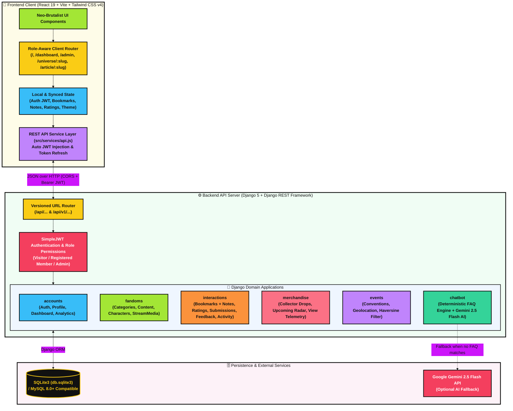
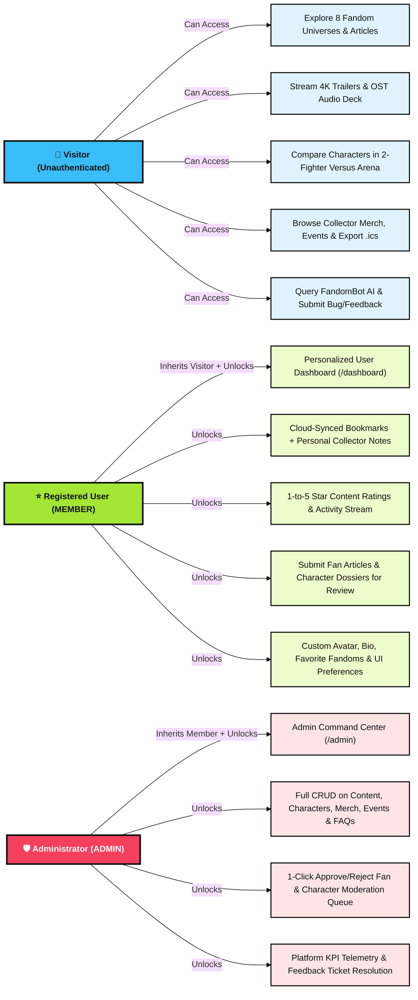
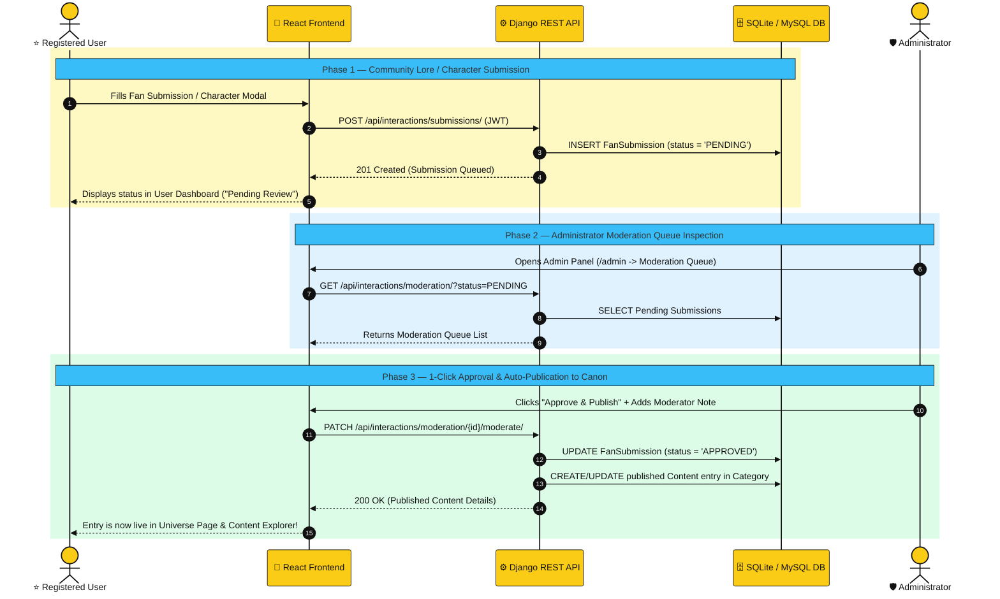
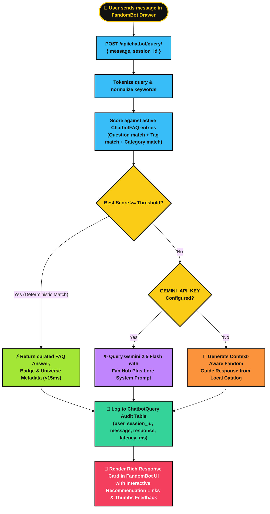
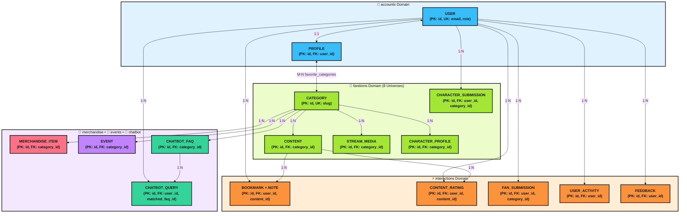

# Fan Hub Plus — Comprehensive Project Documentation

> **Platform Tagline:** *8 Fandom Universes • One Neo-Brutalist Command Center*  
> **Architecture:** React 19 + Vite + Tailwind CSS v4 (Frontend) & Django 5 + Django REST Framework + SimpleJWT (Backend)  
> **Database:** SQLite3 (Development Default, Pre-Seeded) / MySQL 8.0+ Compatible (`seed_data.sql`)

---

## Table of Contents

1. [Project Overview & Vision](#1-project-overview--vision)
2. [Design System: Neo-Brutalist Pop-Culture Aesthetic](#2-design-system-neo-brutalist-pop-culture-aesthetic)
3. [System Architecture & Technology Stack](#3-system-architecture--technology-stack)
4. [User Roles & Core Workflows (with Diagrams)](#4-user-roles--core-workflows-with-diagrams)
5. [Comprehensive Feature Breakdown & Screenshot Placeholders](#5-comprehensive-feature-breakdown--screenshot-placeholders)
6. [Database Design & Entity-Relationship (ER) Diagrams](#6-database-design--entity-relationship-er-diagrams)
7. [RESTful API Specification (`/api/` & `/api/v1/`)](#7-restful-api-specification-api--apiv1)
8. [Setup, Seeding & Deployment Guide](#8-setup-seeding--deployment-guide)

---

## 1. Project Overview & Vision

**Fan Hub Plus** is a centralized, full-stack multi-fandom web application engineered for pop-culture enthusiasts, lore archivists, cosplayers, and collectors. Modern fandom communities are fragmented across dozens of disconnected wikis, video platforms, convention calendars, and social feeds—often cluttered with unverified spoilers, algorithmic noise, and intrusive ads.

Fan Hub Plus solves this fragmentation by uniting **8 core fandom universes** under a single, moderator-vetted, high-contrast **Neo-Brutalist** portal:

| # | Universe Silo | Slug | Accent Color | Core Focus |
| :--- | :--- | :--- | :--- | :--- |
| 1 | **Anime** | `anime` | `#A3E635` (Acid Lime) | Seasonal simulcasts, sakuga breakdowns, character bios, and OP/ED themes |
| 2 | **Gaming** | `gaming` | `#FACC15` (Cyber Yellow) | Patch metas, boss lore archives, speedrun highlights, and co-op builds |
| 3 | **Movies & TV** | `movies-tv` | `#38BDF8` (Electric Cyan) | Cinematic universe timelines, IMAX 4K teasers, and production diaries |
| 4 | **K-Pop** | `kpop` | `#F43F5E` (Hyper Rose) | Comeback calendars, MV streams, discographies, and lightstick sync guides |
| 5 | **Comics** | `comics` | `#FB7185` (Crimson Coral) | Multiverse reading orders, variant covers, and key issue checklists |
| 6 | **Manga** | `manga` | `#FB923C` (Solar Orange) | Weekly chapter trackers, mangaka spotlights, and paneling analyses |
| 7 | **Cosplay** | `cosplay` | `#C084FC` (Neon Violet) | High-density EVA foam blueprints, 3D printing guides, and LED wiring schematics |
| 8 | **Community Vault** | `community-vault` | `#34D399` (Emerald Mint) | Admin-vetted fan essays, canon theories, and verified community showcases |

### Strict Non-Transactional Scope
Per the platform specification, Fan Hub Plus is a **discovery, archival, and community engagement platform**—not an e-commerce store. The **Collector's Merchandise Vault** showcases upcoming statues, vinyl boxsets, and prop replicas with MSRP previews, release countdowns, popularity tracking, and personal bookmark reminders, with **zero shopping carts, checkout flows, or billing fields**.

---

## 2. Design System: Neo-Brutalist Pop-Culture Aesthetic

Fan Hub Plus employs a bespoke **Neo-Brutalist** visual language inspired by physical collector zines, arcade cabinets, and manga tankōbon layouts:

- **Hard Structural Borders:** `2px` and `3px` solid ink borders (`border-2 border-black dark:border-neutral-100`) framing every card, badge, input, and modal.
- **Tactile Offset Shadows:** Non-blurred geometric drop shadows (`shadow-[4px_4px_0px_0px_#000000]` in Light Mode; high-contrast light offset shadows in Dark Mode) with mechanical press animations (`translate-x-[2px] translate-y-[2px]`).
- **Dual-Theme Palette:**
  - **Light Mode (Cream & Canvas):** `#FDFBF7` warm archival paper background with `#111111` ink typography.
  - **Dark Mode (Deep Obsidian):** `#0D1117` / `#161B22` cyber-slate surfaces with crisp white and neon accents.
- **Accessible Typography:** Bold geometric display headers paired with monospace telemetry badges (`font-mono`) and a root **Font-Size Scaler (`A-` / `A+`)** toggling between `16px` standard and `18.5px` high-legibility mode.

> 📸 **SCREENSHOT PLACEHOLDER — Neo-Brutalist Light vs. Dark Mode Comparison**
>
> 
> *(Replace `./screenshots/theme-comparison.png` with your screenshot of the homepage in Light Mode and Dark Mode)*

---

## 3. System Architecture & Technology Stack

### 3.1 High-Level Architecture Diagram



### 3.2 Technology Stack Summary

| Layer | Technology | Purpose |
| :--- | :--- | :--- |
| **Frontend Framework** | React 19 + Vite 8 | Fast component rendering, modular hooks, and instant HMR |
| **Styling & Design Tokens** | Tailwind CSS v4 + Custom Brutalist Utilities | Hard borders, offset shadows, dark mode, and responsive grids |
| **Iconography** | Lucide React | High-contrast vector icons across all 8 universes and controls |
| **Backend Framework** | Python 3 + Django 5 + Django REST Framework | Modular REST API, ORM, data validation, and management commands |
| **Authentication** | `djangorestframework-simplejwt` | Stateless JWT access/refresh tokens with automatic frontend refresh |
| **AI Integration** | Deterministic Keyword/Tag Matcher + `google-genai` | Sub-20ms curated FAQ lookup with optional Gemini 2.5 Flash generation |
| **Database** | SQLite3 (`db.sqlite3`) / MySQL 8.0+ | Relational storage with JSON fields for flexible character stats and preferences |

---

## 4. User Roles & Core Workflows (with Diagrams)

### 4.1 Role-Based Access Matrix



### 4.2 Community Submission & Admin Moderation Workflow

When a registered user submits a fan essay or a new character profile, it enters the `PENDING` moderation queue. Once an administrator approves it in `/admin`, the backend automatically promotes and publishes it into the live `Content` or `CharacterProfile` catalog.



### 4.3 FandomBot AI Hybrid Resolution Workflow



---

## 5. Comprehensive Feature Breakdown & Screenshot Placeholders

### 5.1 Global Header, Accessibility Controls & Dynamic Breadcrumbs
**Files:** [`Header.jsx`](file:///c:/Users/echoe/OneDrive/Documents/GitHub/fanHubPlus/Fanhub_frontend/src/components/Header.jsx), [`Breadcrumbs.jsx`](file:///c:/Users/echoe/OneDrive/Documents/GitHub/fanHubPlus/Fanhub_frontend/src/components/Breadcrumbs.jsx), [`BrutalSkeleton.jsx`](file:///c:/Users/echoe/OneDrive/Documents/GitHub/fanHubPlus/Fanhub_frontend/src/components/BrutalSkeleton.jsx)
- **Sticky Neo-Brutalist Navigation Bar:** Features quick jump links (`Explore`, `Stream`, `Characters`, `Merch`, `Events`), a real-time omni-search bar with `Ctrl+K` / `/` shortcut support, and role-aware action buttons.
- **Zero-Flash Dark Mode Toggle:** Switches between Light Mode (`#FDFBF7`) and Dark Mode (`#0D1117`), persisting in `localStorage` and syncing with the user's profile.
- **Accessible Font-Size Scaler (`A-` / `A+`):** Dynamically scales the root HTML font size between `16px` and `18.5px` for visual comfort.
- **Dynamic Breadcrumbs Bar:** Renders contextual navigation paths (`Home > Universe > Article Title`) whenever users drill into a specific fandom category, article, dashboard, or admin view.
- **Brutalist Skeleton Loaders:** Custom geometric placeholder skeletons (`BrutalCardSkeleton`, `BrutalGridSkeleton`) displayed during asynchronous data hydration.

> 📸 **SCREENSHOT PLACEHOLDER — Header, Search & Dynamic Breadcrumbs**
>
> 
> *(Attach screenshot showing the sticky header, search bar, Dark Mode / `A+` font controls, and breadcrumb bar)*

---

### 5.2 Hero Command Center & 8-Universe Category Matrix
**Files:** [`HeroSection.jsx`](file:///c:/Users/echoe/OneDrive/Documents/GitHub/fanHubPlus/Fanhub_frontend/src/components/HeroSection.jsx), [`UniverseMatrix.jsx`](file:///c:/Users/echoe/OneDrive/Documents/GitHub/fanHubPlus/Fanhub_frontend/src/components/UniverseMatrix.jsx), [`UniversePage.jsx`](file:///c:/Users/echoe/OneDrive/Documents/GitHub/fanHubPlus/Fanhub_frontend/src/components/UniversePage.jsx)
- **Hero Command Center:** Features quick-filter universe pills, live trending dispatches, and an interactive **Featured Spotlight Preview Card** with instant bookmarking and read triggers.
- **8 Interactive Fandom Silo Cards:** Each card in the Universe Matrix displays its distinct category accent color, entry count badge, curated sub-genre tags, featured quote, and top pick.
- **Dedicated Universe Portal (`/universe/:slug`):** Clicking *"Enter Universe Portal"* opens a dedicated multi-tabbed page for that fandom containing:
  - Universe-specific Hero Banner & Featured Canon Quote
  - Sub-genre tag filters & local keyword search
  - Curated + Backend-synced Articles for that universe
  - Universe-specific Character Roster, Trailers, Audio Tracks, and Merch Drops

> 📸 **SCREENSHOT PLACEHOLDER — Hero Section & 8-Universe Matrix**
>
> 
> *(Attach screenshot of the Hero section and the 8 Fandom Universe cards)*

> 📸 **SCREENSHOT PLACEHOLDER — Dedicated Universe Portal Page**
>
> 
> *(Attach screenshot of an opened Universe Portal, e.g., Anime or Gaming)*

---

### 5.3 Multi-Level Fandom Content Explorer & Rich-Text Article Reader
**Files:** [`ContentExplorer.jsx`](file:///c:/Users/echoe/OneDrive/Documents/GitHub/fanHubPlus/Fanhub_frontend/src/components/ContentExplorer.jsx), [`ArticlePage.jsx`](file:///c:/Users/echoe/OneDrive/Documents/GitHub/fanHubPlus/Fanhub_frontend/src/components/ArticlePage.jsx), [`ArticleReader.jsx`](file:///c:/Users/echoe/OneDrive/Documents/GitHub/fanHubPlus/Fanhub_frontend/src/components/ArticleReader.jsx)
- **6-Tier Filter Sidebar/Drawer:** Users can simultaneously filter the unified canon catalog by:
  1. **Keyword Search** (title, synopsis, character, or tag)
  2. **Media / Content Type** (`ALL`, `ARTICLE`, `VIDEO`, `AUDIO`, `IMAGE`)
  3. **Fandom Category** (all 8 silos)
  4. **Genre / Canon Tag** (`Simulcasts`, `Character Lore`, `Lore Bible`, `Canon Timelines`, etc.)
  5. **Release Year** (`All Years`, `2026`, `2025`, `2024`)
  6. **Popularity Threshold** (`90+ High Impact`, `95+ Elite Canon`, `98+ Mythic Tier`)
- **Multi-Mode Sorting:** Sort results by **Most Popular**, **Latest Release**, or **Alphabetical (`A–Z`)**.
- **Single Content Detail & Rich-Text Reader:**
  - Top **Reading Progress Bar** tracking scroll percentage in real time.
  - Executive **Key Takeaways** callout box, structured multi-section headings, pull quotes, and **Pro Tip** callouts.
  - **Interactive 1–5 Star Rating Widget** (persisted locally and synced to `POST /api/interactions/ratings/`).
  - **Inline Personal Collector Note Editor** allowing users to attach study notes or reminders directly to a bookmarked article.

> 📸 **SCREENSHOT PLACEHOLDER — Multi-Level Content Explorer**
>
> 
> *(Attach screenshot of the Content Explorer showing the multi-level filter sidebar and content cards)*

> 📸 **SCREENSHOT PLACEHOLDER — Rich-Text Article Reader**
>
> 
> *(Attach screenshot of the full Article Reader page showing the progress bar, key takeaways, and star rating/bookmark controls)*

---

### 5.4 Stream & Discover Audiovisual Vault
**Files:** [`MultimediaCenter.jsx`](file:///c:/Users/echoe/OneDrive/Documents/GitHub/fanHubPlus/Fanhub_frontend/src/components/MultimediaCenter.jsx)
- **4K Video Trailer Deck:**
  - Supports embedded YouTube IFrame API & HTML5 playback with custom Neo-Brutalist transport controls (Play/Pause, Scrubber Progress Bar, Mute/Unmute, Fullscreen, and **Theater Mode** expansion).
  - Interactive 1–5 Star rating bar and 1-click Vault Bookmarking.
  - Playlist switcher for switching between *Cyberpunk: Edgerunners*, *Demon Slayer: Infinity Castle*, and *Spider-Man: Beyond The Spider-Verse*.
- **OST & K-Pop Audio Deck:**
  - Synchronized **32-Bar Animated Waveform Visualizer** that reacts to playback state.
  - Track transport controls (Previous, Play/Pause, Next, Interactive Seek Bar) and community Like counter (`POST /api/fandoms/stream-discover/{slug}/like/`).

> 📸 **SCREENSHOT PLACEHOLDER — Stream & Discover Audiovisual Vault**
>
> 
> *(Attach screenshot of the 4K Video Trailer player and the Audio Waveform Streamer)*

---

### 5.5 Character Lore Roster & 2-Fighter Versus Stat Comparison Arena
**Files:** [`CharacterArchive.jsx`](file:///c:/Users/echoe/OneDrive/Documents/GitHub/fanHubPlus/Fanhub_frontend/src/components/CharacterArchive.jsx)
- **Interactive Character Cards:** Displays character portraits across all 8 universes (*Ryuto Kazama*, *Valkyrie V-09*, *Shadow Raven*, *Lyra Solaris*, *Kwisatz Navigator*, *AE-Karina Prime*, *Chihiro Rokuhira*, *Archivist Zero*) with animated attribute progress bars, faction badges, and expandable **Full Lore Dossier Modals**.
- **2-Fighter Versus Stat Comparison Arena:**
  - Toggleable **Versus Arena** where users select any two characters (**Fighter A** vs. **Fighter B**) from dropdown selectors.
  - Renders head-to-head comparative progress bars across **Agility / Speed**, **Combat Power**, **Strategic IQ**, plus an **Overall Combat Rating** tally and automatic **Projected Arena Victor** banner.
- **Community Character Submission:** Users can propose new character profiles or lore updates directly via the *"Propose Character Dossier"* button.

> 📸 **SCREENSHOT PLACEHOLDER — Character Lore Roster & Versus Comparison Arena**
>
> 
> *(Attach screenshot showing the Character Roster cards and the 2-Fighter Versus Stat Comparison Arena)*

---

### 5.6 Collector's Merchandise Vault & Live UTC Countdown Radar
**Files:** [`MerchRadar.jsx`](file:///c:/Users/echoe/OneDrive/Documents/GitHub/fanHubPlus/Fanhub_frontend/src/components/MerchRadar.jsx), [`ResourceLibrary.jsx`](file:///c:/Users/echoe/OneDrive/Documents/GitHub/fanHubPlus/Fanhub_frontend/src/components/ResourceLibrary.jsx)
- **Live Tick-Down Release Timers:** Both the *Upcoming Collectibles Radar* and the *Collector's Vault Upcoming Releases* tab feature real-time `DAYS : HRS : MIN : SEC` countdown clocks ticking every second.
- **Multi-Image Thumbnail Gallery & Tag Filtering:** Filter 24+ seeded merchandise items across all 8 universes by fandom category and official status tags (`LIMITED_EDITION`, `PRE_ORDER`, `COLLECTIBLE`, `OFFICIAL_LICENSED`).
- **Popularity Telemetry:** Clicking *"Track Popularity"* or inspecting an item increments its live view counter (`POST /api/merchandise/{slug}/track-click/`).

> 📸 **SCREENSHOT PLACEHOLDER — Collector's Merchandise Vault & Live Countdowns**
>
> 
> *(Attach screenshot of the Collector's Vault showcase grid and the live release countdown timers)*

---

### 5.7 Global Convention Radar, Interactive Map & `.ics` Calendar Export
**Files:** [`ConventionRadar.jsx`](file:///c:/Users/echoe/OneDrive/Documents/GitHub/fanHubPlus/Fanhub_frontend/src/components/ConventionRadar.jsx)
- **Interactive Stylized World Map:** Displays pulsing geolocation pins for major global conventions (*Tokyo Comiket 106*, *Los Angeles Anime Expo*, *London MCM Comic Con*, *Lagos Naija Pop-Con*, *Los Angeles K-Wave Mega Fest*). Clicking any map pin highlights and scrolls to the corresponding event card.
- **City Filter & Haversine Geolocation Lookup:** Users can filter by city (`Tokyo`, `Los Angeles`, `London`, `Lagos`) or click **"Near Me (GPS)"** to sort conventions by physical distance using the backend Haversine formula (`GET /api/events/?lat=...&lng=...&radius=5000`).
- **1-Click `.ics` Calendar Export:** Generates and downloads a standards-compliant `VCALENDAR` (`.ics`) file with start/end dates, venue coordinates, and descriptions for Apple Calendar, Google Calendar, or Outlook.

> 📸 **SCREENSHOT PLACEHOLDER — Global Convention Radar & Interactive Map**
>
> 
> *(Attach screenshot of the Convention Radar showing the interactive world map pins and `.ics` export buttons)*

---

### 5.8 FandomBot AI Lore Assistant
**Files:** [`FandomBot.jsx`](file:///c:/Users/echoe/OneDrive/Documents/GitHub/fanHubPlus/Fanhub_frontend/src/components/FandomBot.jsx)
- **Floating Trigger & Slide-Over Drawer:** Accessible from anywhere on the platform via the bottom-right Neo-Brutalist trigger badge.
- **Starter Prompt Chips:** 1-click prompts for common lore queries (*"Recommend me an anime like Attack on Titan"*, *"Where do I start reading X-Men comics?"*, *"Upcoming gaming conventions in Q4"*).
- **Rich Recommendation Cards & Deep Links:** Parses bolded recommendations into interactive cards that navigate directly to the corresponding Universe Page or Article Reader when clicked.
- **Thumbs Up / Down Feedback & Session Controls:** Users can rate each AI response (`helpful` / `not helpful`) and clear their local/session chat history at any time.

> 📸 **SCREENSHOT PLACEHOLDER — FandomBot AI Lore Assistant Drawer**
>
> 
> *(Attach screenshot of the FandomBot drawer showing a lore response, recommendation cards, and feedback buttons)*

---

### 5.9 Personalized User Dashboard (`/dashboard`)
**Files:** [`UserDashboard.jsx`](file:///c:/Users/echoe/OneDrive/Documents/GitHub/fanHubPlus/Fanhub_frontend/src/components/UserDashboard.jsx)
- **Dedicated Page Route (`/dashboard`):** Immediately accessible after login or via the header's *"My Dashboard"* button.
- **Customized Collector Greeting & KPI Strip:** Displays the logged-in user's username, verification badge, avatar, bio, total bookmarks, personal notes count, favorite fandoms, and recent activity count.
- **Bookmarked Items Vault with Personal Notes:**
  - Filter saved items by type (`Article`, `Character Profile`, `4K Trailer`, `Audio Track`, `Merchandise Item`).
  - Add, edit, or delete **Personal Collector Notes** (`PATCH /api/interactions/bookmarks/note/`) on any bookmarked entry (e.g., *"Pre-order opens Oct 15 at 12:00 PM EST"* or *"Reference Section 3 for Secret Wars timeline"*).
- **Favorite Fandoms & Display Preferences Manager:** Toggle favorite fandom categories, switch between `comfortable` and `compact` grid density, show/hide dashboard widgets, and sync theme/font preferences to the backend profile.
- **Recent Activity Stream & Community Submissions Tracker:** View chronological platform interactions and track the moderation status (`PENDING`, `APPROVED`, `REJECTED`) and moderator feedback of submitted fan works.

> 📸 **SCREENSHOT PLACEHOLDER — Personalized User Dashboard (`/dashboard`)**
>
> 
> *(Attach screenshot of the `/dashboard` page showing the greeting banner, bookmarked items with personal notes, and activity stream)*

---

### 5.10 Administrator Command Center (`/admin`)
**Files:** [`AdminDashboard.jsx`](file:///c:/Users/echoe/OneDrive/Documents/GitHub/fanHubPlus/Fanhub_frontend/src/components/AdminDashboard.jsx)
- **Role-Protected Route (`/admin`):** Restricted to users with `role = 'ADMIN'` or `is_superuser = True` (Demo Admin: `admin@fanhub.com` / `AdminPass123!`).
- **Executive KPI Overview:** Displays real-time counts of registered users, published content, character profiles, merchandise drops, active events, pending submissions, and chatbot query latency metrics.
- **Moderation Queue (Fan Works & Character Profiles):** 1-click **Approve & Publish** or **Reject** workflow with optional moderator feedback notes.
- **Full CRUD Management Tabs:** Create, edit, and delete **Categories**, **Content & Multimedia**, **Character Profiles**, **Merchandise Items**, **Events**, **Chatbot FAQs**, and resolve **User Feedback / Bug Tickets**.

> 📸 **SCREENSHOT PLACEHOLDER — Administrator Command Center (`/admin`)**
>
> 
> *(Attach screenshot of the `/admin` dashboard showing the KPI overview, CRUD tables, and Moderation Queue)*

---

## 6. Database Design & Entity-Relationship (ER) Diagrams

### 6.1 Color-Coded Database Domain & Foreign-Key Map



### 6.2 Complete Schema Entity-Relationship Diagram (Mermaid `erDiagram`)

```mermaid
%%{init: {'theme': 'base', 'themeVariables': { 'primaryColor': '#FACC15', 'primaryTextColor': '#111111', 'primaryBorderColor': '#111111', 'lineColor': '#F43F5E', 'secondaryColor': '#A3E635', 'tertiaryColor': '#38BDF8', 'attributeBackgroundColorOdd': '#FEFCE8', 'attributeBackgroundColorEven': '#ECFDF5', 'fontFamily': 'monospace'}}}%%
erDiagram
    USER ||--|| PROFILE : "has one (1:1)"
    USER ||--o{ BOOKMARK : "saves (1:N)"
    USER ||--o{ CONTENT_RATING : "rates (1:N)"
    USER ||--o{ FAN_SUBMISSION : "submits (1:N)"
    USER ||--o{ CHARACTER_SUBMISSION : "proposes (1:N)"
    USER ||--o{ USER_ACTIVITY : "logs (1:N)"
    USER ||--o{ FEEDBACK : "reports (1:N)"
    USER ||--o{ CHATBOT_QUERY : "asks (1:N)"

    CATEGORY }o--o{ PROFILE : "favorited_by (M:N)"
    CATEGORY ||--o{ CONTENT : "categorizes (1:N)"
    CATEGORY ||--o{ STREAM_MEDIA : "hosts_streams (1:N)"
    CATEGORY ||--o{ CHARACTER_PROFILE : "contains_lore (1:N)"
    CATEGORY ||--o{ CHARACTER_SUBMISSION : "targets_category (1:N)"
    CATEGORY ||--o{ MERCHANDISE_ITEM : "showcases (1:N)"
    CATEGORY ||--o{ EVENT : "tags_event (1:N)"
    CATEGORY ||--o{ FAN_SUBMISSION : "receives_drafts (1:N)"
    CATEGORY ||--o{ CHATBOT_FAQ : "scopes_faq (1:N)"

    CONTENT ||--o{ BOOKMARK : "bookmarked_in (1:N)"
    CONTENT ||--o{ CONTENT_RATING : "rated_in (1:N)"
    CHARACTER_PROFILE ||--o{ CHARACTER_SUBMISSION : "updates_existing (1:N)"
    CHATBOT_FAQ ||--o{ CHATBOT_QUERY : "matched_by (1:N)"

    USER {
        int id PK
        string username UK
        string email UK
        string password
        string role "VISITOR | MEMBER | ADMIN"
        boolean is_verified
        boolean is_staff
        datetime created_at
        datetime updated_at
    }

    PROFILE {
        int id PK
        int user_id FK, UK
        string avatar
        text bio
        string theme_preference "LIGHT | DARK | SYSTEM"
        string font_size_preference "NORMAL | LARGE"
        json dashboard_preferences
        datetime updated_at
    }

    CATEGORY {
        int id PK
        string name UK
        string slug UK
        text description
        string icon
        string accent_color
        string badge_text_color
        string entry_count
        json tags
        string top_pick
        text featured_quote
        datetime created_at
    }

    CONTENT {
        int id PK
        string title
        string slug UK
        int category_id FK
        string content_type "ARTICLE | VIDEO | AUDIO | IMAGE"
        string media_url
        string thumbnail_url
        text body_text
        text synopsis
        string artist_or_author
        string duration
        int duration_seconds
        string release_year
        float popularity_score
        int view_count
        boolean is_published
        datetime created_at
    }

    STREAM_MEDIA {
        int id PK
        string title
        string slug UK
        int category_id FK
        string stream_type "TRAILER | AUDIO"
        string universe_label
        string accent_color
        string media_url
        string thumbnail_url
        text synopsis
        string artist
        string album
        string duration
        int duration_seconds
        float rating
        int view_count
        int likes_count
        boolean is_active
    }

    CHARACTER_PROFILE {
        int id PK
        string name
        string slug UK
        string alias
        int category_id FK
        string archetype
        string origin
        string faction
        text tagline
        text biography
        string image_url
        json stats_json
        json details_json
        datetime created_at
    }

    CHARACTER_SUBMISSION {
        int id PK
        int user_id FK
        int existing_character_id FK
        int category_id FK
        string name
        string alias
        text biography
        json stats_json
        string status "PENDING | APPROVED | REJECTED"
        text admin_feedback
        datetime created_at
    }

    BOOKMARK {
        int id PK
        int user_id FK
        int content_id FK "Nullable for external items"
        string external_id
        string item_title
        string item_type "ARTICLE | CHARACTER | VIDEO | AUDIO | MERCHANDISE"
        string category_name
        string thumbnail_url
        string note "Personal Collector Note (500 chars)"
        datetime created_at
    }

    CONTENT_RATING {
        int id PK
        int user_id FK
        int content_id FK
        int score "1 to 5 stars"
        datetime created_at
    }

    FAN_SUBMISSION {
        int id PK
        int user_id FK
        int category_id FK
        string title
        text body
        string status "PENDING | APPROVED | REJECTED"
        text admin_feedback
        datetime created_at
    }

    FEEDBACK {
        int id PK
        int user_id FK "Nullable for visitors"
        string email
        string name
        string feedback_type "BUG | SUGGESTION | INQUIRY"
        string subject
        text message
        string status "NEW | IN_REVIEW | RESOLVED"
        datetime created_at
    }

    USER_ACTIVITY {
        int id PK
        int user_id FK
        string action_type "VIEW | BOOKMARK | NOTE | RATING | SUBMISSION | CHATBOT | FILTER | PROFILE"
        string target_type
        string target_id
        string target_title
        string category_name
        string detail
        datetime created_at
    }

    MERCHANDISE_ITEM {
        int id PK
        string name
        string slug UK
        int category_id FK
        string image_url
        string tag "LIMITED_EDITION | PRE_ORDER | COLLECTIBLE | OFFICIAL_LICENSED"
        boolean is_upcoming
        string drop_date_text
        string msrp
        string manufacturer
        text description
        int view_count
        float popularity_score
        datetime created_at
    }

    EVENT {
        int id PK
        string title
        string slug UK
        int category_id FK
        string city
        string venue_name
        date start_date
        date end_date
        float latitude
        float longitude
        float map_x
        float map_y
        string ticket_url
        string attendees_info
        string status
        text description
    }

    CHATBOT_FAQ {
        int id PK
        string question
        text answer
        int category_id FK
        string universe_name
        string badge
        json tags
        boolean is_active
    }

    CHATBOT_QUERY {
        int id PK
        int user_id FK
        string session_id
        text message
        text response
        int matched_faq_id FK
        float latency_ms
        datetime created_at
    }
```



### 6.2 Database Domain Breakdown

1. **`accounts` App ([`accounts/models.py`](file:///c:/Users/echoe/OneDrive/Documents/GitHub/fanHubPlus/fanHubPlus_backend/accounts/models.py)):**
   - **`User`**: Custom user model extending `AbstractUser` with `email` as the primary `USERNAME_FIELD` and a `role` enum (`VISITOR`, `MEMBER`, `ADMIN`).
   - **`Profile`**: Automatically instantiated via a `post_save` signal when a `User` is created. Stores `avatar`, `bio`, `theme_preference`, `font_size_preference`, `dashboard_preferences` (JSON), and an `M:N` relationship to `favorite_categories`.
2. **`fandoms` App ([`fandoms/models.py`](file:///c:/Users/echoe/OneDrive/Documents/GitHub/fanHubPlus/fanHubPlus_backend/fandoms/models.py)):**
   - **`Category`**: Stores the 8 mandatory fandom universes, their hex `accent_color`, Lucide `icon` name, `tags`, `top_pick`, and `featured_quote`.
   - **`Content`**: Polymorphic canon catalog (`ARTICLE`, `VIDEO`, `AUDIO`, `IMAGE`) with `popularity_score`, `view_count`, and publication state.
   - **`StreamMedia`**: Dedicated model powering the *Stream & Discover* audiovisual vault with automatic YouTube video ID extraction (`youtube_video_id`) and rating/like counters.
   - **`CharacterProfile` & `CharacterSubmission`**: Stores character lore dossiers with flexible `stats_json` and `details_json` attributes, plus a community submission table for proposing new characters.
3. **`interactions` App ([`interactions/models.py`](file:///c:/Users/echoe/OneDrive/Documents/GitHub/fanHubPlus/fanHubPlus_backend/interactions/models.py)):**
   - **`Bookmark`**: Supports bookmarking both database `Content` rows and external/catalog items (`external_id`, `item_type`) with a `500`-character personal collector `note`.
   - **`ContentRating`**: Enforces a `(user, content)` unique constraint with `MinValueValidator(1)` and `MaxValueValidator(5)`.
   - **`FanSubmission`**: Holds community-submitted articles/guides in `PENDING`, `APPROVED`, or `REJECTED` state.
   - **`Feedback`**: Tracks visitor and member bug reports, suggestions, and inquiries (`NEW`, `IN_REVIEW`, `RESOLVED`).
   - **`UserActivity`**: Chronological audit log of user actions (`VIEW`, `BOOKMARK`, `NOTE`, `RATING`, `SUBMISSION`, `CHATBOT`, `FILTER`, `PROFILE`) for the personalized dashboard.
4. **`merchandise` App ([`merchandise/models.py`](file:///c:/Users/echoe/OneDrive/Documents/GitHub/fanHubPlus/fanHubPlus_backend/merchandise/models.py)):**
   - **`MerchandiseItem`**: Purely non-transactional showcase model storing `tag` (`LIMITED_EDITION`, `PRE_ORDER`, `COLLECTIBLE`, `OFFICIAL_LICENSED`), `drop_date_text`, `msrp` preview string, `manufacturer`, `view_count`, and `popularity_score`.
5. **`events` App ([`events/models.py`](file:///c:/Users/echoe/OneDrive/Documents/GitHub/fanHubPlus/fanHubPlus_backend/events/models.py)):**
   - **`Event`**: Stores global conventions with `latitude`/`longitude` for Haversine distance filtering and `map_x`/`map_y` coordinates for the stylized interactive world map.
6. **`chatbot` App ([`chatbot/models.py`](file:///c:/Users/echoe/OneDrive/Documents/GitHub/fanHubPlus/fanHubPlus_backend/chatbot/models.py)):**
   - **`ChatbotFAQ` & `ChatbotQuery`**: Pre-configured lore Q&A knowledge base and a query audit log recording `session_id`, `matched_faq`, and `latency_ms`.

---

## 7. RESTful API Specification (`/api/` & `/api/v1/`)

All endpoints are exposed under both `/api/` and `/api/v1/` (configured in [`fanHubPlus_backend/fanhub/urls.py`](file:///c:/Users/echoe/OneDrive/Documents/GitHub/fanHubPlus/fanHubPlus_backend/fanhub/urls.py)):

| Domain | Method & Endpoint | Auth | Description |
| :--- | :--- | :--- | :--- |
| **Auth & Accounts** | `POST /api/v1/accounts/register/` | Public | Register a new collector account and return JWT tokens |
| | `POST /api/v1/accounts/login/` | Public | Authenticate by email & password; returns access + refresh JWTs |
| | `POST /api/v1/accounts/token/refresh/` | Public | Refresh an expired JWT access token |
| | `GET /api/v1/accounts/dashboard/` | Member | Fetch aggregated personalized dashboard payload |
| | `GET, PATCH /api/v1/accounts/profile/` | Member | Retrieve or update avatar, bio, favorite fandoms, and UI preferences |
| | `GET /api/v1/accounts/admin/analytics/` | Admin | Fetch platform-wide KPI counts and moderation metrics |
| **Fandoms & Lore** | `GET /api/v1/fandoms/categories/list/` | Public | List all 8 fandom universes with metadata and tags |
| | `GET /api/v1/fandoms/categories/{slug}/` | Public | Retrieve single universe details and associated content |
| | `GET /api/v1/fandoms/content/` | Public | Filter content by `category`, `type`, `search`, and `sort` |
| | `GET /api/v1/fandoms/content/{slug}/detail/` | Public | Retrieve full article/media detail and increment view count |
| | `GET /api/v1/fandoms/characters/` | Public | List character dossiers filtered by `category` or `search` |
| | `GET /api/v1/fandoms/stream-discover/` | Public | Fetch 4K video trailers and audio tracks for Multimedia Center |
| | `POST /api/v1/fandoms/stream-discover/{slug}/rate/` | Public | Submit a 1–5 star rating on a trailer |
| | `POST /api/v1/fandoms/stream-discover/{slug}/like/` | Public | Increment the community like counter on an audio track |
| **Interactions** | `GET /api/v1/interactions/bookmarks/` | Member | List all saved bookmarks and personal collector notes |
| | `POST /api/v1/interactions/bookmarks/toggle/` | Member | Toggle a bookmark on an article, character, video, or merch item |
| | `PATCH /api/v1/interactions/bookmarks/note/` | Member | Save or update a personal note on a bookmark |
| | `GET, POST, DELETE /api/v1/interactions/activity/` | Member | Fetch, log, or clear the user's recent activity stream |
| | `POST /api/v1/interactions/ratings/` | Member | Submit a 1–5 star rating on a `Content` item |
| | `GET, POST /api/v1/interactions/submissions/` | Member | List user's submissions or submit a new fan work for review |
| | `POST /api/v1/interactions/feedback/` | Public | Submit a bug report, platform suggestion, or general inquiry |
| | `PATCH /api/v1/interactions/moderation/{id}/moderate/` | Admin | Approve (and auto-publish) or reject a community submission |
| **Merchandise** | `GET /api/v1/merchandise/` | Public | Paginated list of merchandise drops filtered by `category` & `tag` |
| | `GET /api/v1/merchandise/upcoming/` | Public | List upcoming drops for the release countdown radar |
| | `POST /api/v1/merchandise/{slug}/track-click/` | Public | Increment popularity view count on a merchandise item |
| **Events** | `GET /api/v1/events/` | Public | List conventions with optional city or Haversine `lat`/`lng`/`radius` filter |
| **Chatbot** | `POST /api/v1/chatbot/query/` | Public | Query FandomBot AI (`{ message, session_id }`) |
| | `GET /api/v1/chatbot/history/` | Public | Retrieve session chat history (`?session_id=...`) |

---

## 8. Setup, Seeding & Deployment Guide

### 8.1 Backend Setup (SQLite Default)

```powershell
# 1. Navigate to the backend directory
cd fanHubPlus_backend

# 2. Activate the virtual environment
.\venv\Scripts\activate

# 3. Apply all database migrations
python manage.py migrate

# 4. Seed the SQLite database with all 8 universes, articles, characters, merch, events, FAQs & demo users
python manage.py seed_data

# 5. Start the Django development server on port 8000
python manage.py runserver
```

### 8.2 Pre-Seeded Demo Credentials

| Account Role | Email | Password | Access Scope |
| :--- | :--- | :--- | :--- |
| **Administrator** | `admin@fanhub.com` | `AdminPass123!` | Full access to `/admin`, Moderation Queue, Analytics, and `/dashboard` |
| **Registered Collector** | `fan@fanhub.com` | `MemberPass123!` | Pre-populated `/dashboard` with bookmarks, collector notes, and activity stream |

### 8.3 Frontend Setup

```powershell
# 1. Navigate to the frontend directory
cd Fanhub_frontend

# 2. Install dependencies
npm.cmd install

# 3. Start the Vite development server (http://localhost:5173)
npm.cmd run dev

# 4. Run production build & linter verification
npm.cmd run lint
npm.cmd run build
```

### 8.4 Optional MySQL Migration
When transitioning from SQLite (`db.sqlite3`) to MySQL 8.0+ in production:
1. Update `DATABASES['default']` in [`fanHubPlus_backend/fanhub/settings.py`](file:///c:/Users/echoe/OneDrive/Documents/GitHub/fanHubPlus/fanHubPlus_backend/fanhub/settings.py) to use `django.db.backends.mysql`.
2. Run `python manage.py migrate` followed by `python manage.py seed_data` (or import the standalone [`fanHubPlus_backend/seed_data.sql`](file:///c:/Users/echoe/OneDrive/Documents/GitHub/fanHubPlus/fanHubPlus_backend/seed_data.sql) script).
