# Fan Hub Plus — Complete Project Report & Technical Documentation

**Project Title:** Fan Hub Plus — Centralized Multi-Fandom Discovery, Lore Archive & Community Portal  
**Frontend Stack:** React 19, Vite 8, Tailwind CSS v4, Lucide React  
**Backend Stack:** Python 3, Django 5, Django REST Framework (DRF), SimpleJWT, Google GenAI SDK  
**Database Engine:** SQLite3 (`db.sqlite3`, Pre-Seeded Default) / MySQL 8.0+ Compatible (`seed_data.sql`)  
**API Versioning:** Dual-mounted at `/api/` and `/api/v1/`

---

## Table of Contents

1. [Problem Definition](#1-problem-definition)
2. [Design Specifications](#2-design-specifications)
3. [System Diagrams (Architecture, DFDs, Activity Flowcharts & Sequence Diagrams)](#3-system-diagrams-architecture-dfds-activity-flowcharts--sequence-diagrams)
4. [Database Design, Schema Diagrams & Data Dictionary](#4-database-design-schema-diagrams--data-dictionary)
5. [Comprehensive Feature Breakdown & Screenshot Placeholders](#5-comprehensive-feature-breakdown--screenshot-placeholders)
6. [Test Data Used in the Project & Verification Matrix](#6-test-data-used-in-the-project--verification-matrix)
7. [Project Installation Instructions & Running the App Locally (MANDATORY)](#7-project-installation-instructions--running-the-app-locally-mandatory)
8. [User Credentials for All Types of Users with Passwords (MANDATORY)](#8-user-credentials-for-all-types-of-users-with-passwords-mandatory)
9. [RESTful API Endpoint Reference](#9-restful-api-endpoint-reference)

---

## 1. Problem Definition

### 1.1 Background & Industry Context
Modern pop-culture fandoms—spanning **Anime, Gaming, Movies & TV, K-Pop, Comics, Manga, Cosplay, and Community Scholarship**—generate massive volumes of lore analyses, audiovisual media, character biographies, collectible releases, and global convention schedules. Despite this rapid growth, the digital experience for fans and collectors remains severely fragmented.

### 1.2 Core Problems Addressed
1. **Severe Platform Fragmentation:** Enthusiasts must jump between dozens of disconnected websites—ad-heavy fan wikis for character lore, YouTube/SoundCloud for trailers and OSTs, separate spreadsheets for comic reading orders, and scattered social media threads for convention dates or merchandise drop times.
2. **Unverified Spoilers & Low-Quality Content Clutter:** Open user-edited wikis and unmoderated forums frequently expose readers to unverified canon theories, toxic comment sections, and low-effort spam because there is no structured administrator moderation pipeline before fan contributions go live.
3. **Lack of Personal Collector Organization Tools:** Existing portals rarely allow users to bookmark cross-format items (articles, character profiles, 4K trailers, audio tracks, and merchandise drops) into a single personal vault while attaching private study notes or pre-order reminders to each saved item.
4. **Poor Visual Hierarchy & Accessibility Fatigue:** Legacy wiki layouts suffer from cramped typography, low contrast, jarring layout shifts, and a lack of accessible font-scaling or zero-flash dark mode switches.
5. **Commercial Checkout Distractions:** Collectors looking to track upcoming figure releases, vinyl boxsets, or cosplay prop blueprints are forced onto transactional e-commerce storefronts rather than a dedicated, non-commercial discovery archive.

### 1.3 Proposed Solution & Project Objectives
**Fan Hub Plus** resolves these challenges by providing a unified, full-stack **Neo-Brutalist Command Center** built around eight distinct fandom universes. Its core engineering objectives are:
- **Unified 8-Universe Architecture:** Organize curated and community-approved content across *Anime*, *Gaming*, *Movies & TV*, *K-Pop*, *Comics*, *Manga*, *Cosplay*, and the *Community Vault*.
- **Three-Tier Role-Based Access Control (RBAC):** Support seamless progression from **Unauthenticated Visitors** to **Registered Users (Collectors)** and **Platform Administrators**.
- **Moderator-Gated Community Canon:** Allow registered users to submit fan essays and character dossiers that enter a structured `PENDING` moderation queue, automatically publishing to the live database upon 1-click administrator approval.
- **Personalization & Collector Note-Taking:** Provide every registered user with a customizable `/dashboard` featuring favorite fandom filters, chronological activity logs, and inline personal notes on bookmarked items.
- **Hybrid AI Lore Assistant (`FandomBot`):** Combine a deterministic sub-20ms database FAQ engine with Google Gemini 2.5 Flash AI fallback to answer canon questions and recommend reading/viewing orders.
- **Strict Non-Transactional Scope:** Deliver a pure discovery and archival experience for merchandise and conventions (live UTC countdown clocks, popularity tracking, Haversine GPS convention filtering, and `.ics` calendar exports) with zero payment gateways, shopping carts, or billing fields.

---

## 2. Design Specifications

### 2.1 Architectural Pattern
Fan Hub Plus follows a decoupled **Client-Server REST Architecture**:
- **Presentation Layer (Frontend SPA):** Built with **React 19** and **Vite 8**, utilizing a custom client-side router supporting path-based navigation (`/`, `/dashboard`, `/admin`, `/universe/:slug`, `/article/:slug`) and hash-based section jumping (`#explore`, `#multimedia`, `#characters`, `#merch`, `#events`).
- **Application & Business Logic Layer (Backend API):** Built with **Django 5** and **Django REST Framework (DRF)**, organized into six domain-driven apps (`accounts`, `fandoms`, `interactions`, `merchandise`, `events`, `chatbot`).
- **Data Persistence Layer:** Powered by **SQLite3 (`db.sqlite3`)** out of the box for zero-configuration local execution, with full **MySQL 8.0+** compatibility via Django ORM and a standalone SQL seed script (`seed_data.sql`).

### 2.2 Neo-Brutalist UI/UX & Accessibility Specifications
The user interface implements a high-contrast **Neo-Brutalist** design system engineered for clarity, scannability, and tactile feedback:

| Design Token Category | Specification | Implementation Detail |
| :--- | :--- | :--- |
| **Structural Borders** | Hard `2px` & `3px` solid borders | `border-2 border-black dark:border-neutral-100` on all cards, inputs, buttons, and modals |
| **Offset Shadows** | Solid non-blurred geometric shadows | `shadow-[4px_4px_0px_0px_#000000]` (Light) / `shadow-[4px_4px_0px_0px_#F3F4F6]` (Dark) |
| **Interactive States** | Mechanical press translation | `hover:-translate-y-0.5 active:translate-x-[2px] active:translate-y-[2px]` |
| **Light Theme Canvas** | Warm archival paper & ink | Background `#FDFBF7`, Cards `#FFFFFF`, Primary Text `#111111` |
| **Dark Theme Canvas** | Deep obsidian cyber-slate | Background `#0D1117`, Cards `#161B22`, Primary Text `#F9FAFB` |
| **Font-Size Scaler** | Root HTML accessible scaling | Header `A- / A+` toggle switching root font size between `16px` (`normal`) and `18.5px` (`large`) |
| **Loading States** | Brutalist geometric skeletons | `BrutalCardSkeleton` & `BrutalGridSkeleton` prevent layout shift (CLS) during API calls |

### 2.3 Fandom Universe Color Coding Specification
Each of the 8 mandatory fandom universes is assigned a dedicated high-contrast accent color used consistently across badges, borders, progress bars, and filter pills:

| # | Universe Name | URL Slug | Hex Accent Color | Lucide Icon | Seeded Top Pick |
| :--- | :--- | :--- | :--- | :--- | :--- |
| 1 | **Anime** | `anime` | `#A3E635` (Acid Lime) | `Tv` | *Solo Leveling: Arise* |
| 2 | **Gaming** | `gaming` | `#FACC15` (Cyber Yellow) | `Gamepad2` | *Elden Ring: Nightreign* |
| 3 | **Movies & TV** | `movies-tv` | `#38BDF8` (Electric Cyan) | `Film` | *Avengers: Secret Wars Timeline* |
| 4 | **K-Pop** | `kpop` | `#F43F5E` (Hyper Rose) | `Mic2` | *NewJeans Global Tour* |
| 5 | **Comics** | `comics` | `#FB7185` (Crimson Coral) | `Zap` | *Ultimate Spider-Man 2026* |
| 6 | **Manga** | `manga` | `#FB923C` (Solar Orange) | `BookOpen` | *Berserk Legacy Continuation* |
| 7 | **Cosplay** | `cosplay` | `#C084FC` (Neon Violet) | `Sparkles` | *WCS 2026 Champion Armor* |
| 8 | **Community Vault** | `community-vault` | `#34D399` (Emerald Mint) | `ShieldCheck` | *The Multiverse Paradox Thesis* |

### 2.4 Security, Authentication & Resilience Specifications
- **JWT Authentication (`SimpleJWT`):** Access tokens (60-minute lifetime) and Refresh tokens (7-day lifetime with rotation). The frontend API client (`src/services/api.js`) automatically injects `Authorization: Bearer <token>` headers and transparently retries `401 Unauthorized` requests using `/api/accounts/token/refresh/`.
- **Role-Based Route Guards:** Backend views enforce `IsAuthenticated` and custom `IsAdminRole` permissions (`user.role == 'ADMIN' or user.is_superuser`). Frontend routes guard `/dashboard` and `/admin` with instant role verification.
- **Offline-Resilient Hybrid Hydration:** All public discovery modules initialize with rich curated fallback data (`src/data/fandomData.js`) and seamlessly merge/hydrate with live backend SQLite/MySQL records when the API responds.

---

## 3. System Diagrams (Architecture, DFDs, Activity Flowcharts & Sequence Diagrams)

### 3.1 High-Level System Architecture Diagram

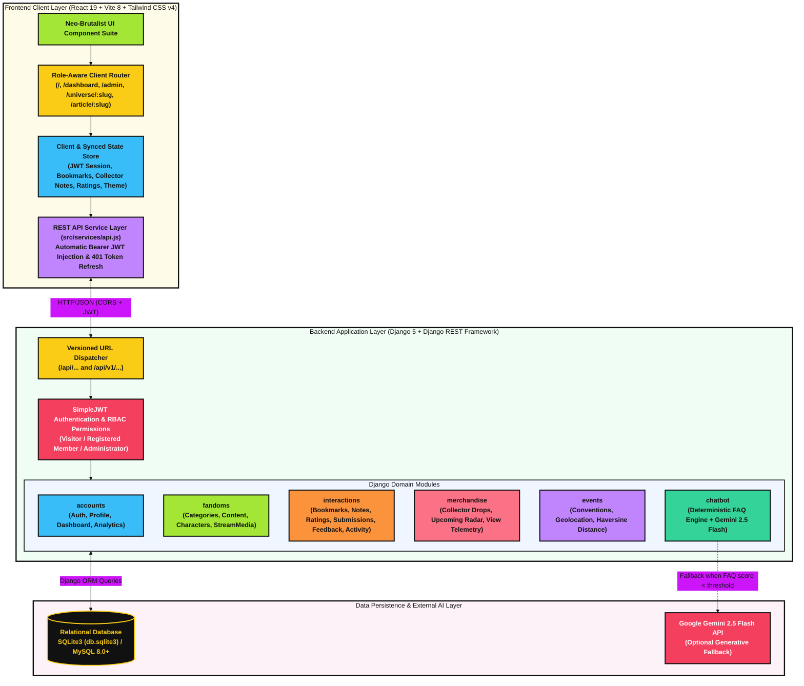

---

### 3.2 Data Flow Diagrams (DFD Level 0 & Level 1)

#### 3.2.1 DFD Level 0 — Context Diagram
The Context Diagram illustrates how the three external entities (**Visitor**, **Registered User**, and **Administrator**) interact with the central **Fan Hub Plus System**.

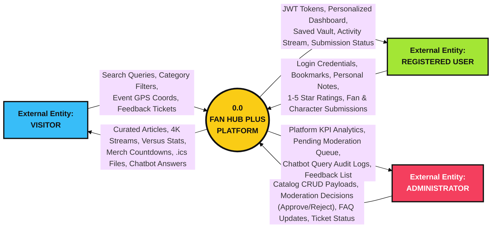

#### 3.2.2 DFD Level 1 — System Process & Data Store Decomposition
The Level 1 Data Flow Diagram decomposes the system into six core functional processes (`P1.0` to `P6.0`) and six relational data stores (`D1` to `D6`).

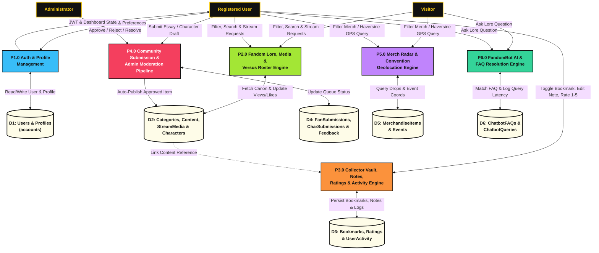

---

### 3.3 Activity Flowcharts for Core Platform Workflows

#### 3.3.1 Activity Flowchart 1 — User Authentication, Registration & Role Routing

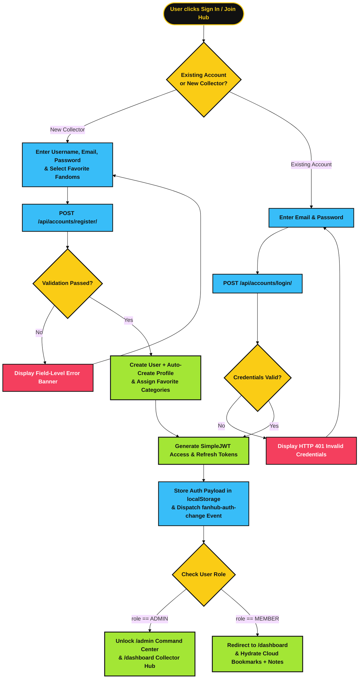

#### 3.3.2 Activity Flowchart 2 — Multi-Level Content Exploration, Bookmarking & Personal Note Workflow

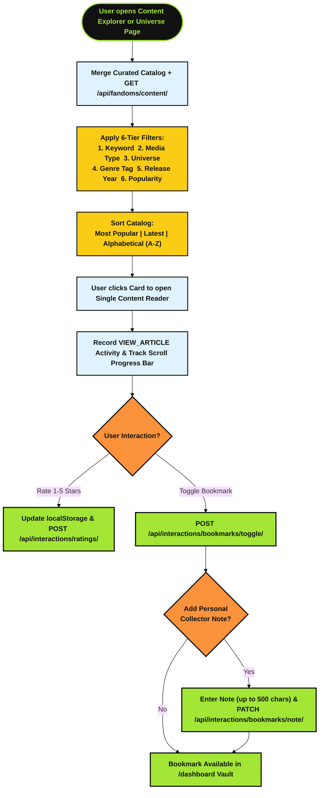

#### 3.3.3 Activity Flowchart 3 — FandomBot AI Hybrid Lore Resolution

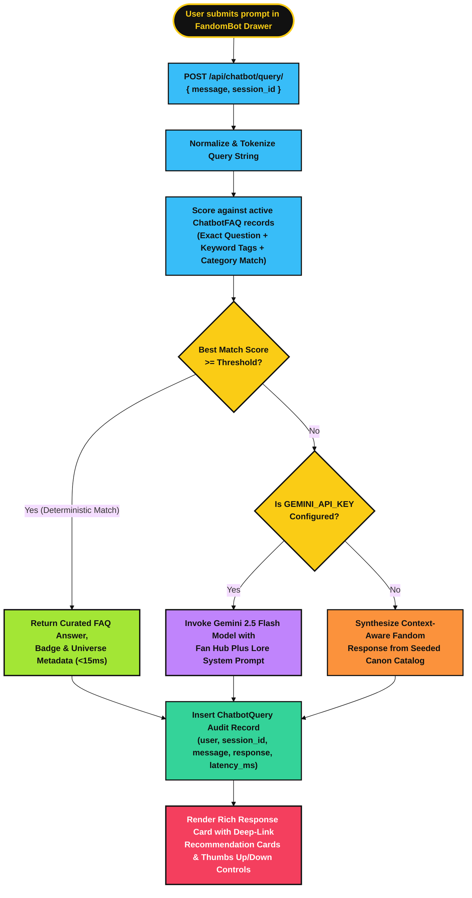

#### 3.3.4 Activity Flowchart 4 — Convention Radar Geolocation (Haversine) & `.ics` Export

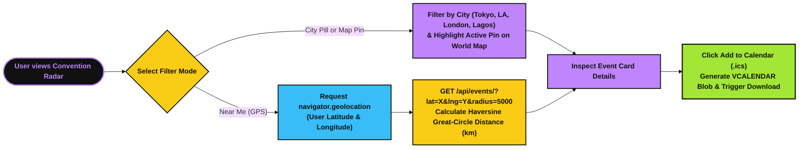

---

### 3.4 Sequence & State Lifecycle Diagrams

#### 3.4.1 Sequence Diagram — Community Submission to Admin Approval & Live Publication

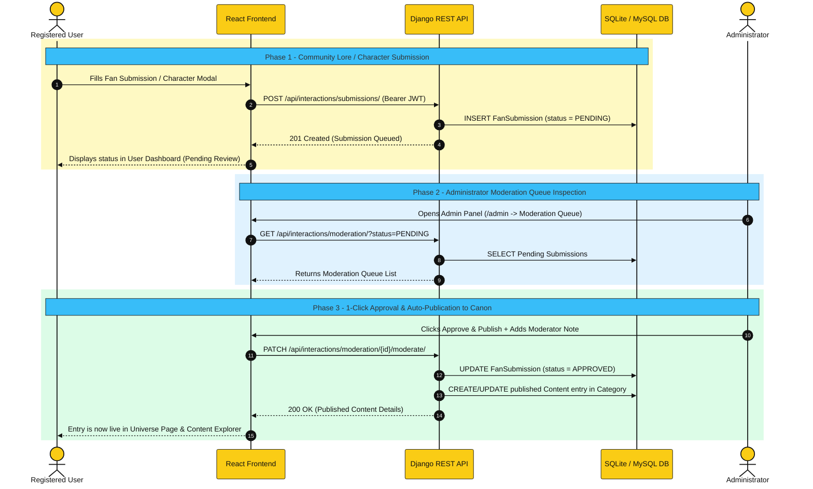

#### 3.4.2 State Diagram — Moderation & Feedback Ticket Lifecycles

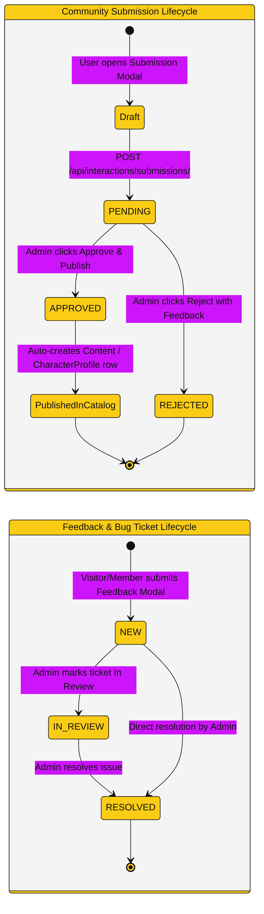

---

## 4. Database Design, Schema Diagrams & Data Dictionary

### 4.1 Color-Coded Database Domain & Foreign-Key Architecture

```mermaid
%%{init: {'theme': 'base', 'themeVariables': { 'lineColor': '#111111', 'fontFamily': 'monospace'}}}%%
flowchart TB
    classDef accTable fill:#38BDF8,stroke:#111111,stroke-width:2.5px,color:#111111,font-weight:bold;
    classDef fanTable fill:#A3E635,stroke:#111111,stroke-width:2.5px,color:#111111,font-weight:bold;
    classDef intTable fill:#FB923C,stroke:#111111,stroke-width:2.5px,color:#111111,font-weight:bold;
    classDef merchTable fill:#FB7185,stroke:#111111,stroke-width:2.5px,color:#111111,font-weight:bold;
    classDef evtTable fill:#C084FC,stroke:#111111,stroke-width:2.5px,color:#111111,font-weight:bold;
    classDef botTable fill:#34D399,stroke:#111111,stroke-width:2.5px,color:#111111,font-weight:bold;

    subgraph AccountsDomain["accounts Domain (Authentication & Personalization)"]
        T_User["USER\n(PK: id | UK: email, username | role)"]:::accTable
        T_Profile["PROFILE\n(PK: id | FK/UK: user_id | M:N favorite_categories)"]:::accTable
    end

    subgraph FandomsDomain["fandoms Domain (8 Universes, Canon Media & Characters)"]
        T_Category["CATEGORY\n(PK: id | UK: name, slug | accent_color)"]:::fanTable
        T_Content["CONTENT\n(PK: id | UK: slug | FK: category_id)"]:::fanTable
        T_Stream["STREAM_MEDIA\n(PK: id | UK: slug | FK: category_id)"]:::fanTable
        T_Char["CHARACTER_PROFILE\n(PK: id | UK: slug | FK: category_id)"]:::fanTable
        T_CharSub["CHARACTER_SUBMISSION\n(PK: id | FK: user_id, category_id, existing_character_id)"]:::fanTable
    end

    subgraph InteractionsDomain["interactions Domain (Collector Vault, Ratings & Moderation)"]
        T_Bookmark["BOOKMARK\n(PK: id | FK: user_id, content_id | note)"]:::intTable
        T_Rating["CONTENT_RATING\n(PK: id | FK: user_id, content_id | score 1-5)"]:::intTable
        T_FanSub["FAN_SUBMISSION\n(PK: id | FK: user_id, category_id | status)"]:::intTable
        T_Activity["USER_ACTIVITY\n(PK: id | FK: user_id | action_type)"]:::intTable
        T_Feedback["FEEDBACK\n(PK: id | FK: user_id | feedback_type, status)"]:::intTable
    end

    subgraph CatalogDomain["merchandise, events & chatbot Domains"]
        T_Merch["MERCHANDISE_ITEM\n(PK: id | UK: slug | FK: category_id | tag)"]:::merchTable
        T_Event["EVENT\n(PK: id | UK: slug | FK: category_id | lat/lng)"]:::evtTable
        T_FAQ["CHATBOT_FAQ\n(PK: id | FK: category_id | tags JSON)"]:::botTable
        T_Query["CHATBOT_QUERY\n(PK: id | FK: user_id, matched_faq_id | latency_ms)"]:::botTable
    end

    style AccountsDomain fill:#E0F2FE,stroke:#111111,stroke-width:2.5px,color:#111111
    style FandomsDomain fill:#ECFCCB,stroke:#111111,stroke-width:2.5px,color:#111111
    style InteractionsDomain fill:#FFEDD5,stroke:#111111,stroke-width:2.5px,color:#111111
    style CatalogDomain fill:#F3E8FF,stroke:#111111,stroke-width:2.5px,color:#111111

    T_User <-->|"1:1 OneToOne"| T_Profile
    T_Profile <-->|"M:N ManyToMany"| T_Category
    T_Category -->|"1:N ForeignKey"| T_Content & T_Stream & T_Char & T_Merch & T_Event & T_FAQ
    T_User -->|"1:N ForeignKey"| T_Bookmark & T_Rating & T_FanSub & T_CharSub & T_Activity & T_Feedback & T_Query
    T_Content -->|"1:N ForeignKey"| T_Bookmark & T_Rating
    T_FAQ -->|"1:N ForeignKey"| T_Query
```

---

### 4.2 Complete Relational Database Schema (`erDiagram`)

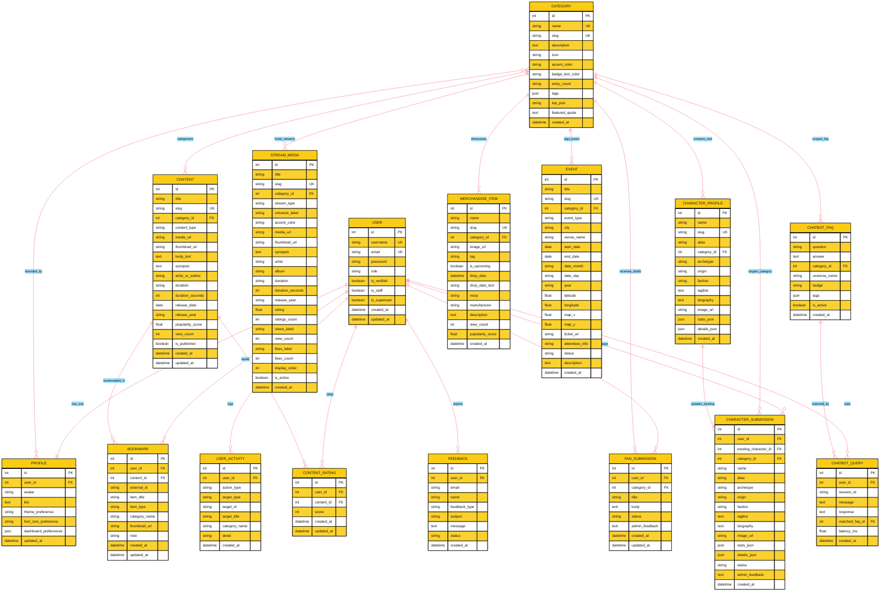

---

### 4.3 Complete Data Dictionary (All 15 Database Tables)

#### Table 1: `accounts_user` (`User`)
Stores authentication credentials and system-wide role permissions. Uses `email` as the primary login identifier (`USERNAME_FIELD = 'email'`).

| Column Name | Data Type | Constraints | Description |
| :--- | :--- | :--- | :--- |
| `id` | `BigAutoField` | `PK`, Auto-Increment | Unique user primary key |
| `username` | `CharField(150)` | `UNIQUE`, `NOT NULL` | Display handle (e.g., `cyber_otaku`, `admin_fanhub`) |
| `email` | `EmailField(254)` | `UNIQUE`, `NOT NULL` | Primary login email address |
| `password` | `CharField(128)` | `NOT NULL` | PBKDF2-SHA256 hashed password string |
| `role` | `CharField(20)` | `INDEX`, Default `'MEMBER'` | Enum: `'VISITOR'`, `'MEMBER'`, `'ADMIN'` |
| `is_verified` | `BooleanField` | Default `False` | Email verification status flag |
| `is_staff` | `BooleanField` | Default `False` | Grants access to Django admin site |
| `is_superuser` | `BooleanField` | Default `False` | Grants all permissions implicitly |
| `created_at` | `DateTimeField` | `auto_now_add=True` | Account registration timestamp |
| `updated_at` | `DateTimeField` | `auto_now=True` | Last account modification timestamp |

#### Table 2: `accounts_profile` (`Profile`)
One-to-one extension of `User` created automatically via Django's `post_save` signal.

| Column Name | Data Type | Constraints | Description |
| :--- | :--- | :--- | :--- |
| `id` | `BigAutoField` | `PK` | Unique profile primary key |
| `user_id` | `ForeignKey` | `UNIQUE`, `ON DELETE CASCADE` | Reference to `accounts_user.id` |
| `avatar` | `CharField(1000)` | `NULL`, `BLANK` | Profile picture URL or preset avatar URI |
| `bio` | `TextField(500)` | `BLANK` | Personal collector manifesto / bio |
| `favorite_categories` | `ManyToManyField` | Bridge table to `Category` | User's selected favorite fandom universes |
| `theme_preference` | `CharField(10)` | Default `'LIGHT'` | Enum: `'LIGHT'`, `'DARK'`, `'SYSTEM'` |
| `font_size_preference`| `CharField(10)` | Default `'NORMAL'` | Enum: `'NORMAL'` (16px), `'LARGE'` (18.5px) |
| `dashboard_preferences`| `JSONField` | Default `{}` | Stores widget visibility and layout density (`comfortable` / `compact`) |
| `updated_at` | `DateTimeField` | `auto_now=True` | Last profile update timestamp |

#### Table 3: `fandoms_category` (`Category`)
Stores the 8 mandatory fandom universes and their visual branding tokens.

| Column Name | Data Type | Constraints | Description |
| :--- | :--- | :--- | :--- |
| `id` | `BigAutoField` | `PK` | Category primary key |
| `name` | `CharField(100)` | `UNIQUE`, `NOT NULL` | Display name (e.g., `Anime`, `Gaming`, `K-Pop`) |
| `slug` | `SlugField(100)` | `UNIQUE`, `INDEX` | URL-safe identifier (e.g., `anime`, `movies-tv`) |
| `description` | `TextField` | `BLANK` | Category overview blurb |
| `icon` | `CharField(50)` | Default `'Tv'` | Lucide React icon identifier |
| `accent_color` | `CharField(20)` | Default `'#38BDF8'` | Hex color code for Neo-Brutalist accents |
| `badge_text_color` | `CharField(20)` | Default `'text-black'` | Tailwind contrast class for category badges |
| `entry_count` | `CharField(50)` | Default `'0+ Entries'` | Display counter label (e.g., `'240+ Entries'`) |
| `tags` | `JSONField` | Default `[]` | Array of sub-genre strings |
| `top_pick` | `CharField(255)` | `BLANK` | Featured spotlight title for this category |
| `featured_quote` | `TextField` | `BLANK` | Thematic quote displayed on the Universe Portal |
| `created_at` | `DateTimeField` | `auto_now_add=True` | Creation timestamp |

#### Table 4: `fandoms_content` (`Content`)
Polymorphic media entity storing articles, video trailers, audio tracks, and visual showcases.

| Column Name | Data Type | Constraints | Description |
| :--- | :--- | :--- | :--- |
| `id` | `BigAutoField` | `PK` | Content primary key |
| `title` | `CharField(255)` | `INDEX`, `NOT NULL` | Entry headline |
| `slug` | `SlugField(255)` | `UNIQUE`, `INDEX` | URL-safe slug |
| `category_id` | `ForeignKey` | `INDEX`, `ON DELETE CASCADE` | Reference to `fandoms_category.id` |
| `content_type` | `CharField(20)` | `INDEX`, Default `'ARTICLE'` | Enum: `'ARTICLE'`, `'VIDEO'`, `'AUDIO'`, `'IMAGE'` |
| `media_url` | `URLField(1000)` | `NULL`, `BLANK` | YouTube / streaming URL for video or audio items |
| `thumbnail_url` | `URLField(1000)` | `NULL`, `BLANK` | High-resolution cover image URL |
| `body_text` | `TextField` | `BLANK` | Full multi-paragraph article/essay body |
| `synopsis` | `TextField` | `BLANK` | Executive summary / card blurb |
| `artist_or_author` | `CharField(255)` | `BLANK` | Creator, studio, or editorial author name |
| `duration` | `CharField(50)` | `BLANK` | Read time or runtime (e.g., `'7 min read'`, `'02:45'`) |
| `duration_seconds` | `PositiveIntegerField`| Default `0` | Duration in seconds |
| `release_year` | `CharField(100)` | `BLANK` | Release year label (e.g., `'2026'`, `'2025'`) |
| `popularity_score` | `FloatField` | `INDEX`, Default `0.0` | Popularity metric used for sorting |
| `view_count` | `PositiveIntegerField`| Default `0` | Total view counter |
| `is_published` | `BooleanField` | `INDEX`, Default `True` | Visibility flag in public endpoints |
| `created_at` | `DateTimeField` | `INDEX`, `auto_now_add=True` | Publication timestamp |

#### Table 5: `fandoms_streammedia` (`StreamMedia`)
Powers the *Stream & Discover* Audiovisual Vault with computed `youtube_video_id` and `embed_url` properties.

| Column Name | Data Type | Constraints | Description |
| :--- | :--- | :--- | :--- |
| `id` | `BigAutoField` | `PK` | Stream item primary key |
| `title` | `CharField(255)` | `INDEX`, `NOT NULL` | Trailer or audio track title |
| `slug` | `SlugField(255)` | `UNIQUE`, `INDEX` | Unique stream slug |
| `category_id` | `ForeignKey` | `INDEX`, `ON DELETE CASCADE` | Reference to `fandoms_category.id` |
| `stream_type` | `CharField(20)` | `INDEX`, Default `'TRAILER'` | Enum: `'TRAILER'`, `'AUDIO'` |
| `media_url` | `URLField(1000)` | `NOT NULL` | YouTube watch/share link |
| `thumbnail_url` | `URLField(1000)` | `BLANK` | Cover art or video poster URL |
| `artist` / `album` | `CharField(255)` | `BLANK` | Studio, performer, or album metadata |
| `duration` / `duration_seconds` | `CharField` / `Int` | Default `'02:45'` / `165` | Formatted and numeric runtime |
| `rating` / `ratings_count` | `FloatField` / `Int` | Default `4.9` / `100` | Community star rating and vote count |
| `view_count` / `likes_count` | `PositiveIntegerField`| Default `0` | Engagement counters |
| `is_active` | `BooleanField` | `INDEX`, Default `True` | Active rotation flag |

#### Table 6: `fandoms_characterprofile` (`CharacterProfile`) & Table 7: `fandoms_charactersubmission` (`CharacterSubmission`)
Stores canon character lore dossiers and user-submitted character proposals.

| Column Name | Data Type | Constraints | Description |
| :--- | :--- | :--- | :--- |
| `id` | `BigAutoField` | `PK` | Primary key |
| `name` / `slug` | `CharField` / `SlugField` | `INDEX` / `UNIQUE` | Character name and URL-safe slug |
| `alias` | `CharField(150)` | `BLANK` | Epithet or title (e.g., `'Titan Slayer'`, `'Cyber Merc'`) |
| `category_id` | `ForeignKey` | `INDEX`, `ON DELETE CASCADE` | Universe category reference |
| `archetype` / `origin` / `faction` | `CharField` | `BLANK` | Lore classification, origin world, and allegiance |
| `tagline` / `biography` | `TextField` | `BLANK` | Signature quote and full character biography |
| `image_url` | `URLField(1000)` | `BLANK` | Character portrait URL |
| `stats_json` | `JSONField` | Default `[]` | Array of stat objects (`{label, value, max, textValue}`) |
| `details_json` | `JSONField` | Default `{}` | Object containing `firstAppearance`, `weapon`, `nemesis`, `bio` |
| `status` *(Submission only)* | `CharField(20)` | Default `'PENDING'` | Enum: `'PENDING'`, `'APPROVED'`, `'REJECTED'` |

#### Table 8: `interactions_bookmark` (`Bookmark`)
Links registered users to saved items across all content types with a personal collector note.

| Column Name | Data Type | Constraints | Description |
| :--- | :--- | :--- | :--- |
| `id` | `BigAutoField` | `PK` | Bookmark primary key |
| `user_id` | `ForeignKey` | `INDEX`, `ON DELETE CASCADE` | Owner user reference |
| `content_id` | `ForeignKey` | `NULL`, `BLANK`, `CASCADE` | Optional FK to `fandoms_content.id` |
| `external_id` | `CharField(150)` | `INDEX`, `BLANK` | Slug/ID for characters, merch, or curated articles |
| `item_title` | `CharField(255)` | `BLANK` | Cached display title of the bookmarked item |
| `item_type` | `CharField(30)` | `INDEX`, Default `'ARTICLE'` | Enum: `'ARTICLE'`, `'CHARACTER'`, `'VIDEO'`, `'AUDIO'`, `'MERCHANDISE'` |
| `category_name` | `CharField(100)` | `BLANK` | Universe name label |
| `thumbnail_url` | `URLField(1000)` | `NULL`, `BLANK` | Item thumbnail image URL |
| `note` | `CharField(500)` | `BLANK` | **Personal Collector Note** (up to 500 characters) |
| `created_at` / `updated_at` | `DateTimeField` | Auto-managed | Timestamps |

#### Table 9: `interactions_contentrating` (`ContentRating`)
Stores 1-to-5 star ratings per user per content item (`UNIQUE(user_id, content_id)`).

| Column Name | Data Type | Constraints | Description |
| :--- | :--- | :--- | :--- |
| `id` | `BigAutoField` | `PK` | Rating primary key |
| `user_id` | `ForeignKey` | `INDEX`, `ON DELETE CASCADE` | Reference to `accounts_user.id` |
| `content_id` | `ForeignKey` | `INDEX`, `ON DELETE CASCADE` | Reference to `fandoms_content.id` |
| `score` | `PositiveSmallInteger`| `MinValue(1)`, `MaxValue(5)` | Star rating between 1 and 5 |

#### Table 10: `interactions_fansubmission` (`FanSubmission`)
Holds user-submitted fan essays, lore theories, and cosplay build guides awaiting moderation.

| Column Name | Data Type | Constraints | Description |
| :--- | :--- | :--- | :--- |
| `id` | `BigAutoField` | `PK` | Submission primary key |
| `user_id` | `ForeignKey` | `INDEX`, `ON DELETE CASCADE` | Author user reference |
| `category_id` | `ForeignKey` | `INDEX`, `ON DELETE CASCADE` | Target fandom universe |
| `title` / `body` | `CharField` / `TextField` | `NOT NULL` | Submission title and markdown/plain-text body |
| `status` | `CharField(20)` | `INDEX`, Default `'PENDING'` | Enum: `'PENDING'`, `'APPROVED'`, `'REJECTED'` |
| `admin_feedback` | `TextField` | `BLANK` | Moderator review notes or rejection reason |

#### Table 11: `interactions_feedback` (`Feedback`) & Table 12: `interactions_useractivity` (`UserActivity`)
Stores support/bug tickets (`BUG`, `SUGGESTION`, `INQUIRY` with status `NEW`, `IN_REVIEW`, `RESOLVED`) and the user's chronological activity stream (`VIEW`, `BOOKMARK`, `NOTE`, `RATING`, `SUBMISSION`, `CHATBOT`, `FILTER`, `PROFILE`).

#### Table 13: `merchandise_merchandiseitem` (`MerchandiseItem`)
Non-transactional collector showcase table.

| Column Name | Data Type | Constraints | Description |
| :--- | :--- | :--- | :--- |
| `id` / `slug` | `BigAutoField` / `Slug` | `PK` / `UNIQUE` | Merchandise primary key and slug |
| `name` | `CharField(255)` | `INDEX`, `NOT NULL` | Collectible name |
| `category_id` | `ForeignKey` | `INDEX`, `ON DELETE CASCADE` | Reference to `fandoms_category.id` |
| `tag` | `CharField(30)` | `INDEX` | Enum: `'LIMITED_EDITION'`, `'PRE_ORDER'`, `'COLLECTIBLE'`, `'OFFICIAL_LICENSED'` |
| `is_upcoming` | `BooleanField` | `INDEX`, Default `False` | Whether item appears on the Upcoming Countdown Radar |
| `drop_date_text` | `CharField(150)` | `BLANK` | Human-readable release window |
| `msrp` / `manufacturer`| `CharField` | `BLANK` | Reference MSRP preview string and studio name |
| `view_count` / `popularity_score` | `Int` / `Float` | `INDEX` | Popularity telemetry counters |

#### Table 14: `events_event` (`Event`)
Global convention schedule with physical and stylized radar coordinates.

| Column Name | Data Type | Constraints | Description |
| :--- | :--- | :--- | :--- |
| `id` / `slug` | `BigAutoField` / `Slug` | `PK` / `UNIQUE` | Event primary key and slug |
| `title` / `city` / `venue_name` | `CharField` | `INDEX` | Event name, host city, and convention center |
| `category_id` | `ForeignKey` | `INDEX`, `ON DELETE CASCADE` | Primary fandom category |
| `start_date` / `end_date` | `DateField` | `INDEX` | Start and end calendar dates |
| `latitude` / `longitude` | `FloatField` | `INDEX` | GPS coordinates for Haversine distance calculation |
| `map_x` / `map_y` | `FloatField` | Default `50.0` | Percentage coordinates (`0–100`) on the stylized world map |
| `ticket_url` / `status` | `URLField` / `CharField`| `BLANK` | Official registration URL and status badge |

#### Table 15: `chatbot_chatbotfaq` (`ChatbotFAQ`) & `chatbot_chatbotquery` (`ChatbotQuery`)
Stores deterministic Q&A pairs (`question`, `answer`, `universe_name`, `badge`, `tags` JSON, `is_active`) and the query audit log (`user_id`, `session_id`, `message`, `response`, `matched_faq_id`, `latency_ms`).

---

## 5. Comprehensive Feature Breakdown & Screenshot Placeholders

### 5.1 Sticky Navigation Header, Accessibility Controls & Dynamic Breadcrumbs
- **Components:** [`Header.jsx`](file:///c:/Users/echoe/OneDrive/Documents/GitHub/fanHubPlus/Fanhub_frontend/src/components/Header.jsx), [`Breadcrumbs.jsx`](file:///c:/Users/echoe/OneDrive/Documents/GitHub/fanHubPlus/Fanhub_frontend/src/components/Breadcrumbs.jsx)
- **Capabilities:** Real-time omni-search input (`Ctrl+K` / `/`), section jump links, zero-flash **Dark Mode Toggle**, root **Font-Size Scaler (`A-` / `A+`)**, role-aware **My Dashboard** / **Admin Panel** badges, and a dynamic **Breadcrumbs** bar (`Home > Universe > Article`).

> **SCREENSHOT PLACEHOLDER 1 — Header, Omni-Search, Dark Mode & Breadcrumbs**  
>   
> *(Place your screenshot at `./screenshots/01-header-breadcrumbs.png`)*

---

### 5.2 Hero Command Center & 8-Universe Category Matrix
- **Components:** [`HeroSection.jsx`](file:///c:/Users/echoe/OneDrive/Documents/GitHub/fanHubPlus/Fanhub_frontend/src/components/HeroSection.jsx), [`UniverseMatrix.jsx`](file:///c:/Users/echoe/OneDrive/Documents/GitHub/fanHubPlus/Fanhub_frontend/src/components/UniverseMatrix.jsx), [`UniversePage.jsx`](file:///c:/Users/echoe/OneDrive/Documents/GitHub/fanHubPlus/Fanhub_frontend/src/components/UniversePage.jsx)
- **Capabilities:** Interactive spotlight preview card, quick-filter universe pills, 8 color-coded fandom silo cards, and dedicated `/universe/:slug` portals with sub-genre filtering and universe-specific media.

> **SCREENSHOT PLACEHOLDER 2 — Hero Command Center & 8-Universe Matrix**  
>   
> *(Place your screenshot at `./screenshots/02-hero-universe-matrix.png`)*

> **SCREENSHOT PLACEHOLDER 3 — Dedicated Universe Portal (`/universe/anime`)**  
>   
> *(Place your screenshot at `./screenshots/03-universe-portal-page.png`)*

---

### 5.3 Multi-Level Fandom Content Explorer & Rich-Text Article Reader
- **Components:** [`ContentExplorer.jsx`](file:///c:/Users/echoe/OneDrive/Documents/GitHub/fanHubPlus/Fanhub_frontend/src/components/ContentExplorer.jsx), [`ArticlePage.jsx`](file:///c:/Users/echoe/OneDrive/Documents/GitHub/fanHubPlus/Fanhub_frontend/src/components/ArticlePage.jsx), [`ArticleReader.jsx`](file:///c:/Users/echoe/OneDrive/Documents/GitHub/fanHubPlus/Fanhub_frontend/src/components/ArticleReader.jsx)
- **Capabilities:** 6-level filter sidebar (Keyword, Media Type, Universe, Genre Tag, Release Year, Popularity Threshold), 3-mode sorting (`Most Popular`, `Latest`, `A-Z`), real-time reading progress bar, 1–5 star rating widget, and inline personal collector note editor.

> **SCREENSHOT PLACEHOLDER 4 — Multi-Level Content Explorer & Filter Sidebar**  
>   
> *(Place your screenshot at `./screenshots/04-content-explorer.png`)*

> **SCREENSHOT PLACEHOLDER 5 — Rich-Text Article Reader & Collector Note Editor**  
>   
> *(Place your screenshot at `./screenshots/05-article-reader.png`)*

---

### 5.4 Stream & Discover Audiovisual Vault
- **Component:** [`MultimediaCenter.jsx`](file:///c:/Users/echoe/OneDrive/Documents/GitHub/fanHubPlus/Fanhub_frontend/src/components/MultimediaCenter.jsx)
- **Capabilities:** 4K Video Trailer player with Theater Mode, custom scrubber/mute/fullscreen transport bar, star ratings, and an OST/K-Pop Audio Streamer with a 32-bar animated waveform visualizer and community like counter.

> **SCREENSHOT PLACEHOLDER 6 — Stream & Discover 4K Video & Audio Waveform Deck**  
>   
> *(Place your screenshot at `./screenshots/06-multimedia-center.png`)*

---

### 5.5 Character Lore Roster & 2-Fighter Versus Stat Comparison Arena
- **Component:** [`CharacterArchive.jsx`](file:///c:/Users/echoe/OneDrive/Documents/GitHub/fanHubPlus/Fanhub_frontend/src/components/CharacterArchive.jsx)
- **Capabilities:** Character cards across all 8 universes, expandable Lore Dossier modal, community character submission trigger, and an interactive **2-Fighter Versus Stat Comparison Arena** comparing Agility, Combat Power, Strategic IQ, and Projected Winner.

> **SCREENSHOT PLACEHOLDER 7 — Character Lore Roster & 2-Fighter Versus Arena**  
>   
> *(Place your screenshot at `./screenshots/07-character-versus-arena.png`)*

---

### 5.6 Collector's Merchandise Vault & Live UTC Countdown Radar
- **Components:** [`MerchRadar.jsx`](file:///c:/Users/echoe/OneDrive/Documents/GitHub/fanHubPlus/Fanhub_frontend/src/components/MerchRadar.jsx), [`ResourceLibrary.jsx`](file:///c:/Users/echoe/OneDrive/Documents/GitHub/fanHubPlus/Fanhub_frontend/src/components/ResourceLibrary.jsx)
- **Capabilities:** 24+ non-transactional merchandise drops across all 8 universes, multi-image gallery switcher, status tag filters (`LIMITED_EDITION`, `PRE_ORDER`, `COLLECTIBLE`, `OFFICIAL_LICENSED`), live `DAYS : HRS : MIN : SEC` countdown timers, and popularity click telemetry.

> **SCREENSHOT PLACEHOLDER 8 — Collector's Merchandise Vault & Live Countdowns**  
>   
> *(Place your screenshot at `./screenshots/08-merch-vault-radar.png`)*

---

### 5.7 Global Convention Radar, Interactive World Map & `.ics` Calendar Export
- **Component:** [`ConventionRadar.jsx`](file:///c:/Users/echoe/OneDrive/Documents/GitHub/fanHubPlus/Fanhub_frontend/src/components/ConventionRadar.jsx)
- **Capabilities:** Interactive world map with pulsing city pins (`Tokyo`, `Los Angeles`, `London`, `Lagos`), Haversine GPS *"Near Me"* distance filtering, and 1-click `.ics` calendar file generation.

> **SCREENSHOT PLACEHOLDER 9 — Global Convention Radar & Interactive Map**  
>   
> *(Place your screenshot at `./screenshots/09-convention-radar.png`)*

---

### 5.8 FandomBot AI Lore Assistant
- **Component:** [`FandomBot.jsx`](file:///c:/Users/echoe/OneDrive/Documents/GitHub/fanHubPlus/Fanhub_frontend/src/components/FandomBot.jsx)
- **Capabilities:** Slide-over chat drawer, 1-click starter prompts, clickable deep-link recommendation cards, thumbs up/down response ratings, and session history clearing.

> **SCREENSHOT PLACEHOLDER 10 — FandomBot AI Lore Assistant Drawer**  
>   
> *(Place your screenshot at `./screenshots/10-fandombot-ai.png`)*

---

### 5.9 Personalized User Dashboard (`/dashboard`) & Admin Command Center (`/admin`)
- **Components:** [`UserDashboard.jsx`](file:///c:/Users/echoe/OneDrive/Documents/GitHub/fanHubPlus/Fanhub_frontend/src/components/UserDashboard.jsx), [`AdminDashboard.jsx`](file:///c:/Users/echoe/OneDrive/Documents/GitHub/fanHubPlus/Fanhub_frontend/src/components/AdminDashboard.jsx)
- **Capabilities:**
  - **User Dashboard (`/dashboard`):** Personalized greeting, KPI strip, Bookmarked Items Vault with inline **Personal Collector Notes**, Favorite Fandoms selector, Display Preferences (`comfortable`/`compact`, widget toggles, theme/font sync), Recent Activity Stream, and Submissions Tracker.
  - **Admin Command Center (`/admin`):** Platform KPI analytics, 1-click Moderation Queue for Fan Submissions & Character Profiles, full CRUD tables for Categories, Content, Characters, Merchandise, Events, and Chatbot FAQs, plus Feedback/Bug ticket resolution.

> **SCREENSHOT PLACEHOLDER 11 — Personalized User Dashboard (`/dashboard`)**  
>   
> *(Place your screenshot at `./screenshots/11-user-dashboard.png`)*

> **SCREENSHOT PLACEHOLDER 12 — Administrator Command Center (`/admin`)**  
>   
> *(Place your screenshot at `./screenshots/12-admin-dashboard.png`)*

---

## 6. Test Data Used in the Project & Verification Matrix

All test data is automatically populated into SQLite (`db.sqlite3`) via `python manage.py seed_data` ([`seed_data.py`](file:///c:/Users/echoe/OneDrive/Documents/GitHub/fanHubPlus/fanHubPlus_backend/fandoms/management/commands/seed_data.py)) or into MySQL via [`seed_data.sql`](file:///c:/Users/echoe/OneDrive/Documents/GitHub/fanHubPlus/fanHubPlus_backend/seed_data.sql).

### 6.1 Seeded Content & Multimedia Records (`Content` & `StreamMedia`)

| Slug | Title | Universe | Type | Author / Artist | Duration | Popularity / Views |
| :--- | :--- | :--- | :--- | :--- | :--- | :--- |
| `jujutsu-kaisen-shinjuku-showdown` | *Jujutsu Kaisen: Shinjuku Showdown Arc & Domain Clash Mechanics* | Anime | `ARTICLE` | Kenji Takahashi | `7 min read` | 4.95 / 84,200 |
| `elden-ring-shadow-erdtree-lore` | *Elden Ring: Shadow of the Erdtree & Nightreign Co-Op Meta Guide* | Gaming | `ARTICLE` | Valkyrie_Builds | `8 min read` | 4.95 / 96,300 |
| `dune-messiah-production-diary` | *Dune: Messiah & The Golden Path — Villeneuve's Tragic Space Opera* | Movies & TV | `ARTICLE` | Elena Vance | `7 min read` | 4.90 / 71,800 |
| `aespa-armageddon-world-tour-recap`| *aespa Armageddon & KWANGYA Lore: The Metallic Hyper-Pop Blueprint* | K-Pop | `ARTICLE` | Soo-Jin Park | `6 min read` | 4.95 / 112,400 |
| `x-men-from-the-ashes-reading-order`| *X-Men: From the Ashes & Post-Krakoa Reading Order Matrix* | Comics | `ARTICLE` | Marcus Sterling | `8 min read` | 4.85 / 49,800 |
| `kagurabachi-enchanted-blades-analysis`| *Kagurabachi: How Enchanted Blades & Cinematic Framing Ignited Jump* | Manga | `ARTICLE` | Daichi Sato | `6 min read` | 4.90 / 73,500 |
| `eva-01-led-foam-armor-blueprint` | *EVA-01 High-Density Foam Armor & Addressable LED Wiring Blueprint* | Cosplay | `ARTICLE` | Lyra Solaris Workshop | `10 min read`| 4.95 / 44,900 |
| `multiverse-paradox-essay` | *The Multiverse Paradox: Canon Continuity Deconstruction* | Community Vault| `ARTICLE` | Fan Creator: cyber_otaku| `8 min read` | 4.80 / 9,200 |
| `cyberpunk-edgerunners` | *Cyberpunk: Edgerunners - Official Teaser* | Anime | `VIDEO` / `TRAILER`| Studio Trigger & CDPR | `02:45` | 4.90 / 4,200,000 |
| `infinity-castle` | *Demon Slayer: Infinity Castle - Cinematic Teaser* | Anime | `VIDEO` / `TRAILER`| ufotable | `03:12` | 5.00 / 7,800,000 |
| `spider-multiverse` | *Spider-Man: Beyond The Spider-Verse Sneak Peek* | Movies & TV | `VIDEO` / `TRAILER`| Sony Pictures Animation | `02:18` | 4.80 / 5,100,000 |
| `kpop-supernova` | *Supernova (Armageddon)* | K-Pop | `AUDIO` | Aespa | `02:59` | 4.90 / 14.8K Likes |
| `money-constant` | *MONEY CONSTANT* | K-Pop | `AUDIO` | DJ Maphorisa, DJ Tunez, Wizkid & Mavo | `03:48` | 4.95 / 84.5K Likes |
| `calm-down` | *Calm Down* | K-Pop | `AUDIO` | Rema | `03:59` | 5.00 / 5.2M Likes |

### 6.2 Seeded Character Lore Profiles (`CharacterProfile` — All 8 Universes)

| Slug | Name | Alias | Universe | Faction | Primary Weapon / Relic |
| :--- | :--- | :--- | :--- | :--- | :--- |
| `ryuto-kazama` | **Ryuto Kazama** | Titan Slayer | Anime | Survey Scout Vanguard Neo | Dual Thunder Spears & Carbon Blade Rigs |
| `valkyrie-v09` | **Valkyrie V-09** | Cyber Merc | Gaming | Afterlife Independent Mercs | Thermal Monowire & Arasaka Prototype MK-7 |
| `paul-muaddib` | **Kwisatz Navigator** | Sovereign of Arrakis | Movies & TV | Fremen Fedaykin Council | Crysknife of Maker Tooth & Weirding Module |
| `nova-kwangya` | **AE-Karina Prime** | Hyper-Pop Avatar | K-Pop | SYNK Hyper-Lineage | Sonic Lightstick Frequency & Rocket Puncher |
| `shadow-raven` | **Shadow Raven** | The Nocturnal Vigilante| Comics | Midnight Syndicate | Obsidian Batarangs & Dark Energy Cloak |
| `kuro-kenshin` | **Chihiro Rokuhira**| Bearer of Enten | Manga | Rokuhira Swordsmith Lineage | Enchanted Blade: Enten (Kuro, Aka, Nishiki) |
| `lyra-solaris` | **Lyra Solaris** | Celestial Weaver | Cosplay | Astral Order of Luminaries | Prism Leyline Staff with Luminescent Core |
| `archivist-zero`| **Archivist Zero** | Keeper of the Vault | Community Vault| Verified Contributors Guild | Cross-Universe Citation Matrix |

### 6.3 Seeded Global Conventions (`Event`)

| Slug | Event Title | City | Venue | Dates | GPS (`lat`, `lng`) | Map (`x%`, `y%`) |
| :--- | :--- | :--- | :--- | :--- | :--- | :--- |
| `event-tokyo` | **Comiket 106 Summer Fan Showcase** | Tokyo | Tokyo Big Sight, Odaiba | Aug 14–16, 2026 | `35.6300, 139.7930` | `78.0, 35.0` |
| `event-la-anime`| **Anime Expo & Gaming Summit 2026** | Los Angeles| LA Convention Center, CA | Jul 02–05, 2026 | `34.0407, -118.2699`| `20.0, 38.0` |
| `event-london` | **MCM Comic Con & World Cosplay Stage**| London | ExCeL London, Royal Dock | Oct 24–26, 2026 | `51.5074, 0.0278` | `48.0, 26.0` |
| `event-lagos` | **Naija Pop-Con & Afro-Anime Fiesta** | Lagos | Landmark Centre, VI Lagos | Nov 18–20, 2026 | `6.4281, 3.4219` | `49.0, 55.0` |
| `event-la-kpop` | **K-Wave Mega Fest & Lightspeed Arena**| Los Angeles| Crypto.com Arena, LA | Dec 10–12, 2026 | `34.0430, -118.2673`| `22.0, 40.0` |

### 6.4 Seeded Bookmarks with Personal Collector Notes, Moderation Queue & Feedback Tickets

- **Pre-Seeded Bookmarks for `cyber_otaku` (`fan@fanhub.com`):**
  1. `cyberpunk-edgerunners` (`VIDEO`): *"Rewatch frame-by-frame for Sandevistan color grading breakdown at 01:42."*
  2. `multiverse-paradox-essay` (`ARTICLE`): *"Reference Section 3 for my upcoming Secret Wars timeline diagram."*
  3. `ryuto-kazama` (`CHARACTER`): *"Cosplay build reference: need 5mm high-density EVA foam for the dual thunder spears."*
  4. `merch-eva` (`MERCHANDISE`): *"Pre-order opens Oct 15 at 12:00 PM EST — set alarm 30 mins early!"*
- **Pre-Seeded Fan Submissions (`FanSubmission`):**
  1. *Neon Genesis Evangelion: The Instrumentality Timeline Paradox* (`Anime` — Status: `PENDING`)
  2. *Elden Ring: Shadow of the Erdtree Miquella Motive Analysis* (`Gaming` — Status: `PENDING`)
  3. *Spider-Man 2099 Monowire Prop 3D Build Log* (`Cosplay` — Status: `APPROVED`)
- **Pre-Seeded Feedback Tickets (`Feedback`):**
  1. `[BUG]` *4K Trailer Player Fullscreen Shortcut on Safari* (`IN_REVIEW`)
  2. `[SUGGESTION]` *Add STL 3D Print File Attachment Support to Cosplay Guides* (`NEW`)
  3. `[INQUIRY]` *K-Wave Mega Fest Los Angeles Badge Pickup Hours* (`RESOLVED`)

### 6.5 Functional Verification Matrix

| Test ID | Module | Test Scenario | Input / Action | Expected Result | Status |
| :--- | :--- | :--- | :--- | :--- | :--- |
| `TC-01` | Auth & RBAC | Login as Registered Member | `fan@fanhub.com` / `MemberPass123!` | Issues JWTs, unlocks `/dashboard`, hides `/admin` | PASS |
| `TC-02` | Auth & RBAC | Login as Administrator | `admin@fanhub.com` / `AdminPass123!` | Issues JWTs, unlocks both `/admin` and `/dashboard` | PASS |
| `TC-03` | Accessibility | Toggle Dark Mode & Font Scaler | Click Moon/Sun & `A+` in Header | Toggles `.dark` class without flash & sets root `18.5px` | PASS |
| `TC-04` | Content Explorer| Multi-Level Filtering & Sorting | Select `Anime` + `ARTICLE` + `Most Popular` | Filters catalog in real time and sorts by popularity | PASS |
| `TC-05` | Bookmarks & Notes| Save Bookmark & Edit Note | Click Bookmark icon -> Edit Note in `/dashboard`| Persists note via `PATCH /api/interactions/bookmarks/note/` | PASS |
| `TC-06` | Character Arena | 2-Fighter Versus Comparison | Select `Ryuto Kazama` vs `Valkyrie V-09` | Renders comparative stat bars & calculates Arena Victor | PASS |
| `TC-07` | Merch Vault | Filter Showcase & Track Click | Click `Gaming` filter + `Track Popularity` | Displays Gaming drops, increments live view counter | PASS |
| `TC-08` | Convention Radar| Map Pin Selection & `.ics` Export| Click `Tokyo` pin -> Click `Add to Calendar` | Highlights Comiket 106 card & downloads `.ics` invite | PASS |
| `TC-09` | FandomBot AI | Deterministic FAQ Query | Ask *"Recommend me an anime like Attack on Titan"*| Returns curated response (<15ms) with clickable cards | PASS |
| `TC-10` | Admin Moderation| Approve Pending Fan Submission | Click `Approve & Publish` in `/admin` Queue | Updates status to `APPROVED` & creates live `Content` | PASS |

---

## 7. Project Installation Instructions & Running the App Locally (MANDATORY)

Follow these step-by-step instructions to install, seed, and run **Fan Hub Plus** on your local machine.

### 7.1 Prerequisites
Ensure the following tools are installed on your system:
- **Python:** `3.11+` or `3.12+` (with `pip` and `venv`)
- **Node.js:** `18.0+` or `20.0+` (with `npm`)
- **Git:** For cloning the repository

---

### 7.2 Step 1 — Clone the Repository

```bash
git clone https://github.com/haleemakintayo/fanHubPlus.git
cd fanHubPlus
```

The repository contains two primary directories:
- `fanHubPlus_backend/` — Django 5 + DRF REST API server & SQLite database (`db.sqlite3`)
- `Fanhub_frontend/` — React 19 + Vite + Tailwind CSS v4 frontend client

---

### 7.3 Step 2 — Backend Installation & Database Seeding (`fanHubPlus_backend`)

#### On Windows (PowerShell):
```powershell
# 1. Navigate to the backend folder
cd fanHubPlus_backend

# 2. Create a Python virtual environment (if not already created)
python -m venv venv

# 3. Activate the virtual environment
.\venv\Scripts\activate

# 4. Install Python dependencies
pip install -r requirements.txt

# 5. Apply database migrations to SQLite (db.sqlite3)
python manage.py migrate

# 6. Seed all 8 universes, articles, trailers, characters, merchandise, events, FAQs & demo users
python manage.py seed_data

# 7. Start the Django backend server at http://127.0.0.1:8000
python manage.py runserver
```

#### On macOS / Linux (Bash / Zsh):
```bash
cd fanHubPlus_backend
python3 -m venv venv
source venv/bin/activate
pip install -r requirements.txt
python manage.py migrate
python manage.py seed_data
python manage.py runserver
```

> **Expected Output of `python manage.py seed_data`:**
> ```text
> Seeding Fan Hub Plus database...
> [OK] Admin and Member users created.
> [OK] Seeded 8 categories.
> [OK] Seeded 14 content items.
> [OK] Seeded 6 Stream & Discover media items.
> [OK] Seeded 8 characters.
> [OK] Seeded 24 merchandise items.
> [OK] Seeded 5 events.
> [OK] Seeded 3 chatbot FAQs.
> All Fan Hub Plus fixtures successfully seeded!
> ```

*(Optional)* If you wish to enable live Google Gemini 2.5 Flash generation for unindexed FandomBot queries, create a `.env` file inside `fanHubPlus_backend/` with:
```env
GEMINI_API_KEY=your_google_gemini_api_key_here
```
*(Note: FandomBot works out-of-the-box without an API key using the deterministic FAQ engine and catalog-aware fallback).*

---

### 7.4 Step 3 — Frontend Installation & Local Dev Server (`Fanhub_frontend`)

Open a **second terminal window** while keeping the Django backend running on port `8000`:

#### On Windows (PowerShell):
```powershell
# 1. Navigate to the frontend folder
cd Fanhub_frontend

# 2. Install Node.js packages
npm.cmd install

# 3. Start the Vite development server
npm.cmd run dev
```

#### On macOS / Linux (Bash / Zsh):
```bash
cd Fanhub_frontend
npm install
npm run dev
```

---

### 7.5 Step 4 — Accessing the Application Locally

Once both servers are running:
- **Frontend Web Application:** Open **[http://localhost:5173](http://localhost:5173)** in your browser.
- **Personalized Collector Dashboard:** **[http://localhost:5173/dashboard](http://localhost:5173/dashboard)**
- **Administrator Command Center:** **[http://localhost:5173/admin](http://localhost:5173/admin)**
- **Backend REST API Root (`/api/v1/`):** **[http://127.0.0.1:8000/api/v1/fandoms/categories/list/](http://127.0.0.1:8000/api/v1/fandoms/categories/list/)**
- **Django Admin Interface:** **[http://127.0.0.1:8000/admin/](http://127.0.0.1:8000/admin/)**

---

## 8. User Credentials for All Types of Users with Passwords (MANDATORY)

The database seeding command (`python manage.py seed_data`) automatically configures accounts for every platform role. Use the credentials below to test all three role tiers:

### 8.1 Master Credentials Table

| User Type / Role | Username | Email Address (Login ID) | Password | Role Code | Key Accessible Routes & Permissions |
| :--- | :--- | :--- | :--- | :--- | :--- |
| **1. Administrator** | `admin_fanhub` | **`admin@fanhub.com`** | **`AdminPass123!`** | `ADMIN` (`is_superuser=True`) | • **Admin Command Center (`/admin`)**<br>• Approve/Reject Fan & Character Moderation Queue<br>• Full CRUD on Categories, Content, Characters, Merch, Events & FAQs<br>• Resolve Bug/Feedback Tickets & View KPI Analytics<br>• Full access to `/dashboard` and all public features |
| **2. Registered User (Member / Collector)** | `cyber_otaku` | **`fan@fanhub.com`** | **`MemberPass123!`** | `MEMBER` (`is_verified=True`) | • **Personalized User Dashboard (`/dashboard`)**<br>• Cloud-synced Bookmarks with **Personal Collector Notes**<br>• Editable Favorite Fandoms (`Anime`, `Gaming`, `Comics`), Avatar, Bio & UI Preferences<br>• 1-to-5 Star Content Ratings & Chronological Activity Stream<br>• Submit Fan Works & Character Profiles for Moderation |
| **3. Visitor (Unauthenticated Guest)** | *N/A (Guest)* | *No login required* | *No password required* | `VISITOR` | • Explore all 8 Fandom Universes (`/universe/:slug`) & Multi-Level Content Explorer<br>• Read Full Articles (`/article/:slug`), Stream 4K Trailers & OST Audio Deck<br>• Compare Characters in the **2-Fighter Versus Arena**<br>• Browse Collector's Merch Vault, Live Countdowns, Convention Radar Map & Export `.ics`<br>• Query **FandomBot AI** & Submit Bug/Feedback Tickets |

### 8.2 How to Switch Between User Roles in the UI
1. **Testing as a Visitor:** Open `http://localhost:5173` without logging in (or click **Logout** in the top-right header).
2. **Testing as a Registered User (`cyber_otaku`):** Click **Sign In** in the top-right header, enter `fan@fanhub.com` and `MemberPass123!` (or click the **Demo Collector** quick-fill button in the login modal), and click **My Dashboard** (`/dashboard`).
3. **Testing as an Administrator (`admin_fanhub`):** Click **Sign In**, enter `admin@fanhub.com` and `AdminPass123!`, and click the **Admin Panel** button in the header to open `/admin`.

---

## 9. RESTful API Endpoint Reference

All backend routes are available under both `/api/` and `/api/v1/`:

| Domain | HTTP Method & Endpoint | Permission | Description |
| :--- | :--- | :--- | :--- |
| **Accounts** | `POST /api/v1/accounts/register/` | `AllowAny` | Register a new user account and return JWT tokens |
| | `POST /api/v1/accounts/login/` | `AllowAny` | Authenticate via email & password; returns access + refresh JWTs |
| | `POST /api/v1/accounts/token/refresh/` | `AllowAny` | Refresh an expired JWT access token |
| | `GET /api/v1/accounts/dashboard/` | `IsAuthenticated` | Retrieve aggregated user dashboard payload (profile, bookmarks, activities, submissions) |
| | `GET, PATCH /api/v1/accounts/profile/` | `IsAuthenticated` | Retrieve or update avatar, bio, favorite fandoms, theme, font size, and dashboard layout |
| | `GET /api/v1/accounts/admin/analytics/` | `IsAdminRole` | Retrieve platform-wide KPI statistics for the Admin Command Center |
| **Fandoms** | `GET /api/v1/fandoms/categories/list/` | `AllowAny` | List all 8 fandom universes with accent colors, icons, and tags |
| | `GET /api/v1/fandoms/categories/{slug}/` | `AllowAny` | Retrieve single category details and associated content |
| | `GET, POST /api/v1/fandoms/content/` | `AllowAny` / `Admin` | Filter published content (`category`, `type`, `search`, `sort`) or create content |
| | `GET /api/v1/fandoms/content/{slug}/detail/` | `AllowAny` | Retrieve single content detail and increment `view_count` |
| | `GET, POST /api/v1/fandoms/characters/` | `AllowAny` / `Admin` | List character lore profiles or create a new character |
| | `GET, POST /api/v1/fandoms/character-submissions/` | `IsAuthenticated` | Submit a new community character dossier for review |
| | `GET /api/v1/fandoms/stream-discover/` | `AllowAny` | Retrieve active 4K trailers and audio tracks |
| | `POST /api/v1/fandoms/stream-discover/{slug}/rate/` | `AllowAny` | Rate a video trailer (1–5 stars) |
| | `POST /api/v1/fandoms/stream-discover/{slug}/like/` | `AllowAny` | Increment the community like counter on an audio track |
| **Interactions**| `GET /api/v1/interactions/bookmarks/` | `IsAuthenticated` | List all saved bookmarks and personal notes for the current user |
| | `POST /api/v1/interactions/bookmarks/toggle/` | `IsAuthenticated` | Add or remove a bookmark (`content_id` or `external_id`) |
| | `PATCH /api/v1/interactions/bookmarks/note/` | `IsAuthenticated` | Add or update a 500-char personal note on a bookmark |
| | `GET, POST, DELETE /api/v1/interactions/activity/`| `IsAuthenticated` | Fetch, log, or clear the user's chronological activity stream |
| | `POST /api/v1/interactions/ratings/` | `IsAuthenticated` | Submit or update a 1–5 star rating on a `Content` item |
| | `GET, POST /api/v1/interactions/submissions/` | `IsAuthenticated` | List user's fan submissions or submit a new essay/guide |
| | `GET /api/v1/interactions/moderation/` | `IsAdminRole` | List fan submissions filtered by moderation status (`ALL`, `PENDING`, `APPROVED`, `REJECTED`) |
| | `PATCH /api/v1/interactions/moderation/{id}/moderate/` | `IsAdminRole` | Approve (and auto-publish to `Content`) or reject a fan submission |
| | `POST /api/v1/interactions/feedback/` | `AllowAny` | Submit a bug report, platform suggestion, or general inquiry |
| | `GET, PATCH /api/v1/interactions/admin/feedback/`| `IsAdminRole` | List and update status (`NEW`, `IN_REVIEW`, `RESOLVED`) of feedback tickets |
| **Merchandise** | `GET /api/v1/merchandise/` | `AllowAny` | Paginated merchandise showcase filtered by `category` and `tag` |
| | `GET /api/v1/merchandise/upcoming/` | `AllowAny` | List upcoming merchandise drops for the countdown radar |
| | `POST /api/v1/merchandise/{slug}/track-click/` | `AllowAny` | Increment popularity `view_count` on a merchandise item |
| **Events** | `GET /api/v1/events/` | `AllowAny` | List conventions with optional `city` or Haversine `lat`/`lng`/`radius` filtering |
| **Chatbot** | `POST /api/v1/chatbot/query/` | `AllowAny` | Submit a lore query to FandomBot AI (`{ message, session_id }`) |
| | `GET /api/v1/chatbot/history/` | `AllowAny` | Fetch chat history for a `session_id` |
| | `GET, POST /api/v1/chatbot/faqs/manage/` | `IsAdminRole` | Manage curated `ChatbotFAQ` knowledge base entries |
| | `GET /api/v1/chatbot/audit/` | `IsAdminRole` | Inspect `ChatbotQuery` audit logs and response latency |
